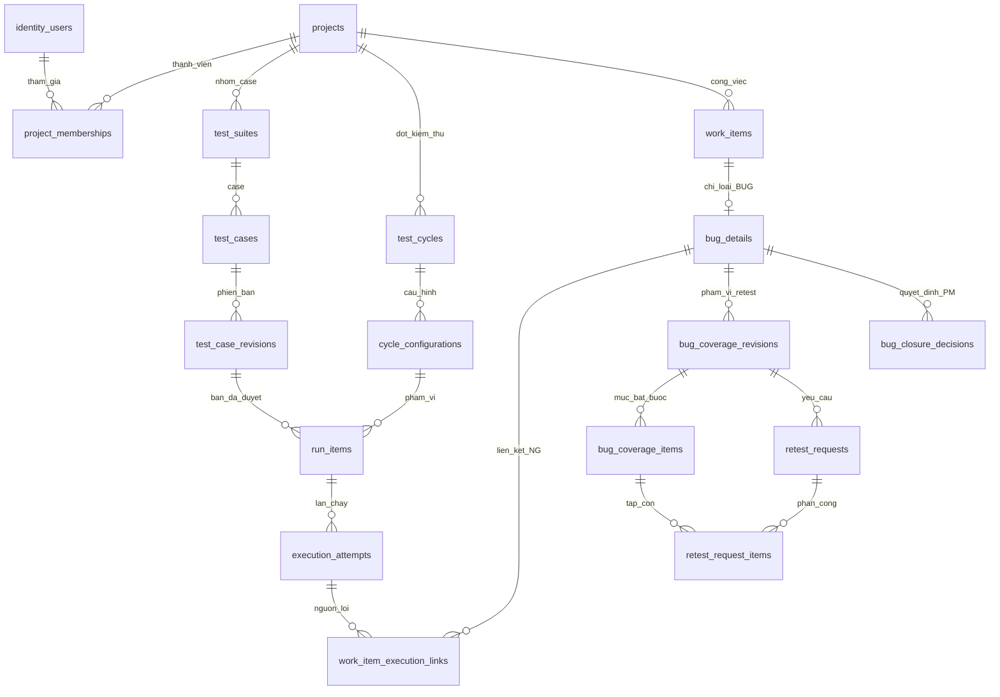

# Thiết kế database hiện hành — V11

Review 03/10: [phân tích đầy đủ 56 bảng, phần có thể tinh gọn và cải tiến đã kiểm thử](../reviews/2026-10-03-database-complexity.md). Schema/ERD vẫn V11; phần thay đổi mới nằm ở dữ liệu ghi vào history, không phải DDL.

Cập nhật 01/10/2026. TMS có **một schema tms, 56 bảng gồm Flyway**, không phải 56 database. Nguồn chính xác là V1–V11 và [metadata trích từ MySQL](erd/schema.json): 514 cột, 128 constraint FK. Không tạo thêm bảng từ tên dự thảo trong blueprint cũ.

- [Ảnh ERD đủ 56 bảng, 514 cột, 128 FK (PNG)](erd/images/00-toan-bo-56-bang.png)
- [Tám ảnh chi tiết theo nhóm và cách đọc](erd/images/README.md)
- [Ảnh vector đầy đủ (SVG)](erd/images/00-toan-bo-56-bang.svg)
- [Mermaid đầy đủ 56 bảng](erd/full-schema.mmd)
- [DDL chỉ schema để import mô hình Workbench](erd/schema-only.sql)
- [Review và đề xuất tối giản](../reviews/2026-10-01-database-native-mysql.md)
- [Kết nối MySQL Windows/Workbench từng bước](mysql-workbench.md)

## Luồng dữ liệu chính

Sơ đồ dưới lược bỏ actor/audit/catalog và một số bảng nối để đọc nghiệp vụ. ERD đầy đủ bên trên giữ FK thực tế.

bug_verification_attempts tham chiếu composite tới từng mục request, người thực hiện và evidence. BUG_ONLY chỉ xác minh bug; FULL_CASE mới ghi thêm execution_attempts cho cả case.

## Vì sao tách bảng?

**Case khác revision.** Sửa case không thay bản đã đưa vào đợt; run ghim revision được PM duyệt.

**Run item khác attempt.** Case A trên Web/iPad tạo hai lượt; chạy lại iPad ba lần tạo ba attempts của cùng lượt. Retest không tăng mẫu số báo cáo.

**Công việc khác bug detail.** Board, danh sách và quản lý lỗi đọc chung work_items; bug_details mở rộng 1:0..1 để task/yêu cầu không phải có trường lỗi giả.

**Coverage khác request/kết quả.** PM chốt toàn bộ phạm vi retest, chia cho Tester theo build/cấu hình. Chỉ đóng FIXED khi tất cả mục đạt trên phạm vi hiện hành. FAIL/đổi build/scope/reopen làm bằng chứng cũ hết hiệu lực để đóng nhưng không xóa lịch sử.

**Báo cáo không là nguồn thứ hai.** Dashboard/tiến độ/Excel truy vấn run/attempt/bug trong snapshot. Không có bảng riêng cho từng màn hoặc phần trăm UI.

## Ràng buộc và giao dịch

- FK ghép chứa project_id ngăn liên kết khác dự án; service vẫn kiểm tra quyền, active và approval.
- User dùng UUID, domain chủ yếu BIGINT; hợp lệ khi FK giữ đúng kiểu. Không đổi hàng loạt chỉ để đồng nhất hình thức.
- Mutation khóa dự án trước, kiểm tra version, cấp số bằng project_counters. Retry có request key/checksum; không MAX+1 ngoài khóa.
- latest_attempt_id, current revision/coverage là con trỏ có FK về đúng cha. Không lưu thêm một trạng thái hiện tại độc lập làm lệch history.
- Snapshot giữ tên/context khi chạy, quan hệ vẫn là cột chuẩn hóa. Không giấu mảng ID trong JSON thay FK.
- Append-only được enforce ở API/service; tài khoản MySQL DML hoặc DBA vẫn có thể sửa trực tiếp. Không tuyên bố chống DBA sửa dữ liệu.
- Evidence blob ở ngoài MySQL, bảng giữ metadata/hash/owner; backup cần DB và thư mục evidence.
- Archive giữ FK/lịch sử; không cascade xóa domain để dọn demo.

## Trạng thái và quyền

S02/S03/S05–S09 có implementation nội bộ; S04/S10/S11 còn gate tại [STATUS](../planning/STATUS.json). cycle_statuses đã có DRAFT/ACTIVE/CLOSED. Kết quả OK/NG/P; NA là quyết định phạm vi, Fix không phải OK. Mười trạng thái work item và closure theo ADR-006/007/008, chưa tự biến thành rule khách.

ADMIN hoặc PM được cấp riêng tạo tài khoản theo ma trận quyền; project_role khác role hệ thống. Approval case, triage, coverage và closure do PM dự án; Tester ghi kết quả đúng phân công. Backend enforce các quyền này.

## Giảm phức tạp hợp lý

Đã giới hạn JSON history khi UPDATE công việc vào các trường có thể sửa; không sao chép lại links/clarifications/externalReferences/contextSnapshot và quyền hiển thị ở mỗi lần sửa. Dữ liệu lịch sử cũ được giữ. Xem [định dạng history](../api/work-items.md).

Có thể nghiên cứu bỏ foundation_checks hoặc gộp bug_retest_state vào bug_details. Giữ application_info vì IdentityService dùng dòng singleton làm khóa bootstrap Admin. Policy nền INTERNAL_V1 và rule_versions dự án có phạm vi khác nhau; JSON mô tả policy nền không phải engine thực thi rule. Mỗi thay đổi DDL cần migration/backfill/test riêng. Không gộp history chỉ để đạt một con số bảng tùy ý.

Schema vẫn V11; migration tiếp theo khi có thay đổi thật là V12. Chuyển server/seed không cần migration mới; V1–V11 giữ nguyên. Danh mục từng bảng ở [README database](README.md), phát hiện và giới hạn ở [review](../reviews/2026-10-01-database-native-mysql.md).
