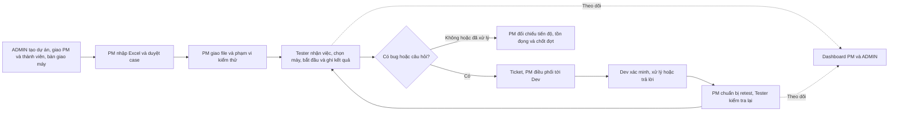

# PRD — Hệ thống quản lý dự án và kiểm thử TMS

Phiên bản tài liệu: **1.3 — 07/10/2026**. Chủ sản phẩm: người dùng/đơn vị vận hành. Nhánh `system-design`; F01–F05/Q01–Q03 đã triển khai, native đã áp V17–V20. Mục 1–15 giữ baseline trước F/Q, mục 16 giữ checkpoint source, **mục 17 là trạng thái hiện hành**, thay các ghi chú native/HTTP còn mở ở checkpoint cũ. [Kế hoạch](../../tasks/plan.md). Đây không phải biên bản khách hàng ký nghiệm thu.

## 1. Bài toán và kết quả mong muốn

Công ty nhận nhiều dự án kiểm thử. ADMIN cần biết dự án nào đang thực hiện, ai phụ trách, có bao nhiêu người/máy, kết quả thực thi và tồn đọng. PM cần tiếp nhận nguồn test từ Excel, giao việc, kiểm soát build/phạm vi, phối hợp Dev và xác nhận chất lượng. Tester cần một nơi thấy đúng việc được giao, biết file và máy đang làm, lưu kết quả có lịch sử, log bug/câu hỏi và nhận retest. Dev cần đúng bug/câu hỏi liên quan tới mình, đủ ngữ cảnh để xử lý và gửi phản hồi có căn cứ.

Kết quả sản phẩm là truy vết được **dự án → file → case/revision → lượt thực thi → người/máy/build → bug hoặc câu hỏi → bản sửa → retest → quyết định PM**. Mỗi mắt xích phải dùng dữ liệu đã lưu, kiểm soát quyền ở server và bảo toàn lịch sử. Giao diện hiển thị thành công sau khi server xác nhận, không chỉ đổi nhãn trong bộ nhớ trình duyệt.

Luồng mục tiêu do người dùng yêu cầu:

Sơ đồ là luồng mục tiêu đã có implementation F/Q và bằng chứng native/HTTP tại mục 17. PM điều phối bug và retest theo quyền đã duyệt; không có tự động gửi thông báo cho Dev/Tester.

## 2. Người dùng, phạm vi và quyền sở hữu

| Người dùng | Nhu cầu chính | Trách nhiệm và giới hạn |
| --- | --- | --- |
| ADMIN tổng | Điều phối danh mục dự án, người và máy; xem toàn hệ thống | Tạo dự án, chọn PM/Tester/Dev, tài khoản, membership, bàn giao/thu hồi, dashboard/audit. Không tự trở thành PM của mọi dự án |
| PM dự án | Quản lý nội dung, phân công, tiến độ và chất lượng | Nhập/duyệt case, cấu hình đợt, giao việc, triage ticket, coverage/retest, NA/chốt đợt, báo cáo lý do chậm. Không tự quản trị tổng |
| TESTER | Thực thi và xác minh đúng việc được giao | Ghi OK/NG/P trên run đang được giao; tạo bug, bình luận/chứng cứ; retest được giao. Không phân công, duyệt case hoặc đóng bug |
| DEV | Xác minh và xử lý bug của mình | Xem dữ liệu dự án; BUG được giao chưa terminal: cập nhật `progress`/`resolved`, ghi lý do/build sửa/bình luận/chứng cứ. Không ghi kết quả test, retest, NA hoặc đóng bug |
| Vận hành | Chạy ứng dụng, migration, sao lưu, phục hồi | Cấu hình ngoài repository; kiểm tra bằng công cụ phát triển. Không giả làm PM để sửa dữ liệu nghiệp vụ bằng SQL |

Role hệ thống và role membership là hai lớp. ADMIN được đọc mọi dự án qua API quản trị, nhưng không vì vậy có quyền đọc/sửa nội dung nghiệp vụ qua API thành viên của dự án mình không tham gia. `admin.local` là tên tài khoản hiện dùng; định tuyến theo role ADMIN, không hardcode username. User có thể tham gia nhiều dự án qua membership. Máy vật lý chỉ bàn giao cho một dự án tại một thời điểm.

## 3. Mục tiêu, chỉ số thành công và dữ liệu đo

| Mục tiêu | Tiêu chí nghiệm thu | Tình trạng đo |
| --- | --- | --- |
| Truy vết công việc | Một file được giao dẫn tới đúng revision/run, actor, build/máy, ticket và retest; không nhầm dự án | Chưa UAT luồng file mục tiêu |
| Kết quả đáng tin cậy | Refresh giữ dữ liệu; export lấy nguồn kết quả đúng ngữ cảnh; không mất lịch sử/retry tạo trùng | Có regression document/execution cũ; file execution export chưa có |
| PM biết ai đang làm gì | Thấy Tester, file, máy, giờ bắt đầu/trạng thái và OK/NG/P/NA/chưa chạy | Báo cáo run đã có; DOING/file/máy thực tế còn thiếu |
| Phân quyền đúng | Negative test cho đọc/ghi khác dự án, Dev ghi test, Tester đóng bug, gỡ membership/khóa tài khoản | Có tests; chưa tái chạy tất cả native/E2E trong lượt này |
| Cải thiện vận hành | Tỷ lệ thực thi/đạt nhất quán giữa dashboard và export; lưu lý do chậm | Có công thức/report PM; số liệu thời gian tiết kiệm chưa đo |
| Dễ thao tác | Không cắt chữ/nút, cuộn được, giữ bản nháp khi lỗi, nhận biết đang lưu/đã lưu/xung đột | Có kiểm tra UI trước và 344 FE tests hiện tại; chưa kiểm hết bằng UAT |

Không đặt số liệu cải thiện, SLA, tỷ lệ coverage hay thời gian phản hồi thành giá trị đã đạt khi chưa có đo. Quy mô pilot, mục tiêu hiệu năng và RPO/RTO production cần chủ vận hành xác nhận.

## 4. Bản đồ capability

| ID | Capability | Hiện trạng | Phụ thuộc |
| --- | --- | --- | --- |
| M01 | Identity/session/tài khoản | HIỆN CÓ | Không phụ thuộc module nghiệp vụ |
| M02 | ADMIN dự án, membership, quản trị tổng | HIỆN CÓ; native/UAT còn gate | M01 |
| M03 | Kho máy và bàn giao dự án | HIỆN CÓ; chưa có máy trong DB sử dụng | M01, M02 |
| M04 | Catalog/build/mốc/rule/handbook | HIỆN CÓ trong phạm vi nội bộ | M02 |
| M05 | Excel, tài liệu, revision/approval | HIỆN CÓ | M02, M04 |
| M06 | Cycle/config/run/assignment/attempt | HIỆN CÓ | M04, M05 |
| M07 | Bug/ticket/bình luận/chứng cứ | HIỆN CÓ với lifecycle BUG; non-BUG chưa có closure | M06 |
| M08 | Coverage/retest/closure/reopen | HIỆN CÓ | M06, M07 |
| M09 | Báo cáo/dashboard/PM status report/audit | HIỆN CÓ | M02, M03, M06–M08 |
| M10 | Redmine outbox/reconcile | HIỆN CÓ phạm vi sandbox; mapping khách chưa chốt | M07 |
| F | Giao việc theo file, phiên và máy thực tế, bảng file execution | MỘT PHẦN/CHƯA CÓ — ĐỀ XUẤT | M03, M05, M06, M09; không tạo nguồn verdict mới |
| Q | Câu hỏi QA và handoff tới Dev/Tester | CHƯA CÓ — ĐỀ XUẤT | M07, M08, M09; không nới quyền Dev trên mọi ticket |

Ranh giới module F/Q là đề xuất review. Không lập một migration gom cả roadmap. Tái dùng M06/M08, giữ dependency một chiều; dashboard đọc dữ liệu nghiệp vụ, không ghi verdict ngược vào thực thi.

## 5. Phạm vi đã có và cần giữ

### M01 — Tài khoản và đăng nhập

- R01: đăng nhập/đăng xuất/hết phiên bằng session ở server, CSRF cho ghi; không dùng localStorage làm authority quyền.
- R02: ADMIN tạo ADMIN/PM/TESTER/DEV và khóa/mở khóa tài khoản; không công khai đăng ký.
- R03: PM chỉ tạo TESTER nếu được ADMIN cấp riêng; không tạo ADMIN/PM/DEV hoặc cấp quyền tiếp.
- R04: mật khẩu được băm, không trả hash qua API/audit. Mật khẩu demo người dùng đã yêu cầu là cấu hình local riêng; không seed mật khẩu chung vào tài liệu hay mã release.
- R05: khóa/đổi quyền thu hồi phiên theo implementation; version ngăn cập nhật từ dữ liệu cũ.

### M02 — ADMIN dự án và thành viên

- R06: ADMIN tạo dự án với code/name/description/timezone, **chọn rõ ít nhất một PM** và thành viên Tester/Dev ban đầu, có thể chọn máy để bàn giao trong cùng transaction.
- R07: không tự thêm người tạo làm PM. Chọn người/máy ban đầu **không phải hạn mức tối đa**; ADMIN có thể bổ sung về sau.
- R08: ADMIN quản lý thông tin dự án và membership, có version/audit; chặn gỡ/hạ quyền PM cuối cùng theo policy membership. Trạng thái archived hiện được đọc và khóa ghi; source hiện chưa có command archive/unarchive dự án. Nếu bổ sung command này, phải chặn khi còn phiên file DOING/PAUSED.
- R09: dashboard ADMIN tổng hợp toàn hệ thống. Tab Dự án mặc định Tất cả, sau đó chọn riêng dự án; không có bộ chọn phạm vi toàn cục ở header ADMIN. Users/Devices/Audit có bộ lọc tại trang.
- R10: PM tiếp nhận dự án của mình, không có nút tự tạo dự án hoặc tự thay thành viên thay ADMIN.

### M03 — Kho máy

- R11: từng tài sản có mã máy, loại IPAD/IPHONE/ANDROID/OTHER, model/serial/OS/tình trạng/ghi chú; tên loại không thay identity máy.
- R12: ADMIN bàn giao/thu hồi theo dự án, người nhận, ngày dự kiến trả, lý do và lịch sử. Cạnh tranh giao cùng máy không tạo hai allocation active.
- R13: không bàn giao máy bảo trì/ngừng sử dụng; dự án/member phải hợp lệ. PM xem máy đang được bàn giao cho dự án.
- R14: logical device trong cấu hình kiểm thử và physical asset trong kho là hai khái niệm; không đổi `deviceId` của attempt thành `assetId`.

### M04–M05 — Nội dung kiểm thử và Excel

- R15: PM quản lý suite/case, case có identity ổn định và revision bất biến; revision mới không viết lại execution cũ. Chỉ PM chính dự án duyệt revision.
- R16: import `.xlsx` qua preview → kiểm lỗi → commit nguyên batch; lỗi không để một nửa file đã nhập. Không âm thầm ghi đè case đang có.
- R17: mẫu khách được nhận diện theo tên cột/alias, không phụ thuộc vị trí cố định. Bắt buộc ID, Đối tượng test, Các bước test, Kết quả mong đợi. Giữ Unicode, xuống dòng, tên file, thứ tự/cột phụ/dữ liệu gốc.
- R18: Đối tượng test trống được kế thừa dòng trước để tạo case khi hợp lệ, nhưng ô nguồn vẫn trống theo quyết định đã duyệt. M/N không tiêu đề giữ nguyên; không tự tính thành kết quả của một lượt test.
- R19: file mở ra bảng testcase, cuộn hai chiều, nội dung nhiều dòng, nút lịch sử dưới số case, phiên bản/approval và cột nguồn tương ứng. Không bỏ màn case/history đã khôi phục.
- R20: annotation tài liệu mặc định UNEXECUTED; bấm trực tiếp tuần tự UNEXECUTED → OK → P → NG → FIXED → NA → UNEXECUTED, tự lưu theo dòng. OK xanh dương, P vàng, NG đỏ, FIXED xanh lá, NA có màu riêng và nhãn; không chỉ dùng màu để nhận biết.
- R21: “Xuất Excel” tài liệu lấy revision/annotation mới đã lưu; “Tải file gốc” trả nguyên bản. Khóa export khi còn ghi/chưa giải quyết lỗi. Hai bản không phải export execution.

### M06 — Đợt và thực thi

- R22: PM tạo cycle DRAFT, chọn cấu hình môi trường/logical device/default build, thêm revision đã duyệt và assignee; activate khi đủ điều kiện.
- R23: một case/cấu hình/cycle là run item. Phân công và lần chạy có lịch sử; revision scope đóng băng sau activate. Chỉ người được giao, tài khoản/membership active, role không phải Dev, ghi trong cycle ACTIVE.
- R24: execution chỉ ghi OK/NG/P. NG cần actual result; P cần lý do. NOT_RUN là chưa có attempt, FIXED là trạng thái bug/tài liệu, NA là quyết định PM loại scope.
- R25: actor/time lấy từ session/server; build/context cùng dự án và snapshot được giữ. Mỗi lần lưu là attempt mới; không sửa/xóa lịch sử.
- R26: retry cùng key/body/actor/run trả bản cũ; key khác payload hoặc version stale báo xung đột. Không tự ghi lại draft lên version mới sau lỗi.

### M07–M08 — Ticket, Dev và retest

- R27: Tester tạo BUG từ NG hoặc revision; PM có thể tạo bug ngoài case với lý do. Steps/expected/actual/context phải đầy đủ; dùng một work-item identity, không tạo kho bug song song.
- R28: PM triage/phân công/ưu tiên; Tester chưa được chọn Dev trực tiếp. Mọi comment/evidence/tracker reference gắn đúng ticket/dự án.
- R29: Dev chỉ xử lý BUG được giao chưa terminal; vào `progress` hoặc `resolved`, có nội dung xử lý/version; resolved cần fixed build. Resolve chưa có nghĩa bug được kiểm chứng hoặc case OK.
- R30: PM xác nhận coverage rồi giao request retest đúng Tester/build/env/device. Tester submit PASS/FAIL với BUG_ONLY hoặc FULL_CASE.
- R31: BUG_ONLY không đổi execution. FULL_CASE ghi OK/NG attempt mới; FAIL tự liên kết NG, trả bug về progress và vô hiệu vòng cũ. PASS không tự đóng bug.
- R32: PM đóng bug đã đủ coverage PASS hoặc ngoại lệ có evidence/nguồn xác nhận; mở lại có lý do. Không cho generic transition/batch vượt guard closure.
- R33: QA/câu hỏi chưa phải loại đã có. REQUEST hiện tồn tại nhưng không có workflow hỏi/đáp Dev/Tester hay closure non-BUG hoàn chỉnh; không mô tả REQUEST như QA đã hoạt động.

### M09–M10 — Theo dõi và tích hợp

- R34: báo cáo PM và ADMIN lấy run item/attempt, không lấy annotation Excel; tỷ lệ thực thi và đạt có mẫu số đúng, cùng bộ lọc/build/timezone.
- R35: deadline dựa mốc có kế hoạch. Quá hạn còn phạm vi/công việc chưa hoàn tất được cảnh báo; thiếu kế hoạch ghi Chưa đủ dữ liệu, không tự kết luận nhanh/chậm từ phần trăm.
- R36: PM gửi status report bất biến: tiến triển, lý do chậm/kế hoạch phục hồi/ngày dự kiến khi cần. Báo cáo PM không xóa cảnh báo thực tế.
- R37: audit chỉ trả trường được phép, actor/time/action/context cần thiết; không trả credential/session/hash.
- R38: Redmine chỉ publish/retry/reconcile có quyền PM và mapping được cấu hình; outbox thành công chưa có nghĩa đã gửi. Remote status không tự đóng bug hoặc pass case. Khách hàng production chưa có mapping/UAT được duyệt.

## 6. Phần bổ sung để đạt luồng theo file — ĐÃ DUYỆT, ĐANG TRIỂN KHAI

### F01 — Giao nguyên file trong ngữ cảnh execution

PM chọn file COMMITTED, cycle DRAFT/cấu hình, revision đã duyệt và Tester. Server tạo nhóm giao file gắn **chính xác run IDs** của execution hiện hữu; không chỉ thêm assignee vào tên file rồi bỏ qua scope. Các case chưa duyệt/archive hoặc vượt giới hạn phải được báo cụ thể trước xác nhận; không bỏ qua âm thầm. Giao nhiều cấu hình là nhiều nhóm rõ ràng. Phân công lại có lý do/version/history và không đổi executor quá khứ.

MVP đã duyệt mỗi nhóm file/cấu hình có một Tester chính; chia case/nhiều Tester trong cùng nhóm là mở rộng riêng. Import cùng tên nhưng batch khác không được lẫn nhóm. Revision mới sau giao vẫn cần PM chuẩn bị phạm vi mới, không thay nội dung lượt đang chạy.

### F02 — Công việc của tôi và phiên đang làm

Tester thấy file được giao, dự án/cycle/build/cấu hình, số case, hạn mốc, tiến độ và nút Bắt đầu/Tạm dừng/Kết thúc. Bắt đầu ghi executor thật, giờ server và máy được chọn; không gõ tên người khác. Trạng thái công việc READY/DOING/PAUSED/COMPLETED/CANCELLED tách khỏi kết quả case; READY là trạng thái đọc suy ra khi chưa có phiên.

Một nhóm chỉ có một phiên DOING; một máy vật lý chỉ có một phiên DOING trong MVP. Một người có thể làm nhiều file nếu dùng máy khác. Máy được phép dùng phải thuộc allocation active đúng dự án và người nhận; chia sẻ máy trong nhóm là mở rộng riêng. Khi thu hồi máy/khóa tài khoản/gỡ membership, writes mới bị từ chối và lịch sử được giữ, PM xử lý phiên bị chặn có lý do. Resume giữ nguyên máy/build; đổi ngữ cảnh phải cancel và start mới.

“Kết thúc thực thi” có thể còn NG đã log bug; không có nghĩa release đạt. Chặn kết thúc nếu còn NOT_RUN/P trong scope áp dụng hoặc NG hiện hành chưa có BUG liên kết đúng attempt trên build phiên. Tester có thể tạm dừng có lý do. PM vẫn giữ quyền chốt đợt/tồn đọng.

### F03 — Ghi kết quả trên file theo lượt đang test

Trong **chế độ thực thi**, bảng file dùng revision đã pin và kết quả mới nhất của run trong nhóm/cấu hình/build được chọn; mọi ghi đi qua ExecutionService. NG yêu cầu actual, P yêu cầu lý do; NA chỉ PM. Không biến nút FIXED annotation thành execution OK hoặc cho Tester đổi NA không có quyết định.

Giữ **chế độ tài liệu tham khảo** hiện có để sửa annotation/export tài liệu theo quyết định trước. Hai chế độ phải có nhãn/ngữ cảnh rõ ràng; không yêu cầu người dùng hiểu schema. Mở từ công việc được giao mặc định vào chế độ thực thi, theo D-F1 đã duyệt.

### F04 — PM theo dõi file, Tester và máy

Trang PM có bảng một dòng/nhóm file: Tester, máy thực tế, cycle/config/build, trạng thái phiên, bắt đầu/lần cập nhật cuối, NOT_RUN/OK/NG/P/NA, bug mở, retest đang chờ. Filter theo file/người/build/trạng thái. Tổng group phải dùng cùng ReportMetrics; không cộng tổng file nguồn vào tổng run hoặc đếm trùng một run thuộc nhiều view.

### F05 — Export đúng ngữ cảnh đang xem

Ba lựa chọn đã duyệt: **Xuất lượt kiểm thử này** (revision pinned + verdict/actor/máy/build của nhóm đã chọn), **Xuất tài liệu cập nhật** (annotation hiện hữu), **Tải file gốc** (bytes nguồn). Bản execution ghi context/nguồn trong sheet metadata để tái đối chiếu; một PASS của một build không viết OK cho build hoặc file khác. Giữ Unicode/style/cột phụ trong khả năng an toàn của workbook; không tạo formula/hyperlink nguy hiểm.

## 7. QA và handoff — ĐÃ DUYỆT, ĐANG TRIỂN KHAI

| ID | Hành vi | Thiết kế đã duyệt |
| --- | --- | --- |
| Q01 | Tester đặt câu hỏi chưa chắc là bug | Loại QA riêng cùng work-item counter/identity, nội dung câu hỏi và context file/case/run tùy chọn; không bắt actual NG/fixed build như BUG |
| Q02 | PM giao Dev, Dev trả lời, Tester xác nhận | PM triage/assignee; chỉ Dev được giao trả lời/xin làm rõ; Tester chủ câu hỏi xác nhận hoặc phản hồi; PM đóng. Trạng thái/điều kiện riêng, không nới Dev xử lý mọi REQUEST/TASK |
| Q03 | Bug đã sửa cần quay lại Tester | Queue PM phân biệt Chờ chuẩn bị retest/Đã giao/Đang xác minh/Đủ điều kiện đóng. Nút chuẩn bị retest dùng coverage hiện hành, không tự suy toàn phạm vi hoặc tự đóng |

Câu hỏi trở thành bug phải tạo/link BUG có đủ context và bằng chứng, giữ câu hỏi/lịch sử cũ; không đổi type để mất identity hoặc ghi NG giả. Thông báo trong ứng dụng/hàng chờ có thể bổ sung; gửi email/Slack cho người khác không thuộc mặc định và cần cấu hình/ủy quyền riêng.

Đã chọn QA riêng theo D-Q1; không dùng REQUEST làm QA. QA giữ work-item identity và canonical status, câu trả lời/xác nhận bất biến theo phiên bản. PM đóng sau xác nhận đúng câu trả lời hiện hành, hoặc ngoại lệ được ghi rõ lý do; không suy QA đã trả lời thành BUG đã sửa.

## 8. Quy tắc dữ liệu và báo cáo không được phá

1. Tài liệu nguồn, annotation cập nhật, revision case, execution và verification là những lớp khác nhau. Mỗi export phải nêu nguồn và context.
2. ID file là import batch, không phải tên file, cycle hoặc test case. Run giữ revision đã duyệt; annotation lấy current revision của thư viện.
3. Kết quả của một run trên một build không tự áp dụng mọi build/cấu hình, mọi bug của case hoặc mọi bản import.
4. Thực thi = (OK + NG)/(T − NA); đạt = OK/(T − NA). D=0 hiển thị chưa có phạm vi, không giả 0% hoặc 100%.
5. FIXED/resolved là Dev báo sửa. Người được phân công đủ điều kiện (TESTER hoặc PM) xác minh; PM quyết định closure. P là tạm hoãn, không được tính đã thực thi. Luồng thông thường giao Tester, không tự bỏ quyền PM thực thi/retest đang có.
6. Actor/time từ server; không sửa audit/history để thay tên Tester. Membership/asset/revision cùng project được kiểm ở server/FK khi phù hợp.
7. Archive/đóng đợt là khóa ghi theo policy, không xóa nguồn hoặc lịch sử. Retry/idempotency và optimistic locking là bắt buộc cho command có nguy cơ lặp.

## 9. Yêu cầu UX

- ADMIN, PM, Tester, Dev có điều hướng theo role; một màn không mời thao tác bị policy từ chối. Quyền vẫn enforce server.
- Mỗi trang có loading/empty/error/retry. Xung đột giữ draft, tải lại để đối chiếu; không báo đã lưu khi server lỗi.
- Bảng dài cuộn dọc/ngang bằng chuột và bàn phím, header giữ dễ đọc; ô nhiều dòng không cắt mất nội dung. Không mở form không cần thiết dưới bảng annotation.
- Nút case/menu ba gạch mở revision/history/chứng cứ đúng case/context, có nhãn trợ năng.
- Form/nút/select đủ chiều cao, label gắn field, focus nhìn được. Modal giữ focus, Escape/đóng và trả focus; thao tác đang lưu khóa phù hợp, tránh ghi trùng.
- Trạng thái có chữ và màu; lỗi có message cụ thể, không chỉ icon. Dữ liệu nguồn Nhật/Việt không bị dịch/chuẩn hóa làm mất nội dung.
- Hiển thị timezone dự án, context build/device/cycle rõ; không đưa healthcheck/Flyway/SQL/log kỹ thuật vào dashboard nghiệp vụ.
- Không coi màu đẹp hoặc bố cục mới là cải tiến nếu làm mất màn đã có hoặc đứt API.

## 10. Yêu cầu phi chức năng và vận hành

| Nhóm | Yêu cầu |
| --- | --- |
| An toàn | Session/CSRF, project isolation, role guard, không trả secret, validate input/file, escape nội dung và kiểm soát tải evidence |
| Tính đúng | Transaction cho command liên quan; current locking read trước mutation cạnh tranh; FK cùng dự án; không nhân số liệu khi join N:N |
| Khả dụng thao tác | Giữ draft/retry/idempotency, lỗi mạng không mất dữ liệu hoặc giả lưu; xác nhận archive/thu hồi/chốt có lý do khi policy yêu cầu |
| Hiệu năng | Pagination tại server, danh sách không tải blob; bounded scope/import/export. Mục tiêu production phải đo/duyệt trên quy mô thực |
| Truy vết | Audit/assignment/attempt/verification/closure append-only, context snapshot và version; dữ liệu sửa tạo bản ghi mới |
| Vận hành | Java 21/Spring Boot + React JS/Vite, MySQL Server native/Workbench và Flyway; Docker không là điều kiện chạy web |
| Phục hồi | Backup MySQL + nguồn workbook/evidence + cấu hình riêng; rehearsal schema cô lập. Không repair/reset database đang sử dụng để bỏ lỗi |
| Tuân thủ dữ liệu | Khách chưa có account/visibility production. Retention, tải/xóa dữ liệu cá nhân và phân vùng vận hành cần chủ sản phẩm xác nhận |

## 11. Giới hạn kỹ thuật hiện hành

- Import: `.xlsx`, tối đa 5 MiB/500 dòng/64 cột cho mẫu khách; quy tắc sheet/công thức/ô gộp theo contract đã có. Không tuyên bố mọi workbook tùy ý đều được hỗ trợ.
- Một request thêm scope tối đa 100 revision; cycle tối đa 500 run và 50 cấu hình. File 500 case × hai cấu hình không vừa một cycle hiện hành; phải báo và chọn thiết kế giới hạn/tách scope trước, không cắt case.
- Evidence: PNG/JPG/PDF/MP4, tối đa 20 MiB/tệp và 100 tệp/ticket; evidenceReference của attempt là text, không phải upload.
- Coverage retest tối đa 100 run/phiên bản scope; page size 1–100 theo contract từng API.
- Không hứa cập nhật realtime hoặc notifications khi chưa có implementation; dashboard hiện lấy snapshot khi tải/tải lại.

## 12. Ngoài phạm vi đã duyệt

Không tự tạo customer login, sửa rule/Redmine mapping khách, thay stack, thêm Docker runtime, tự sync remote thành authority, gửi messages ra ngoài, tự triển khai production hoặc sửa migration đã áp dụng. Không đổi annotation thành execution hoặc cấp Dev quyền test/closure vì muốn hoàn tất luồng nhanh hơn.

## 13. Tiêu chí nghiệm thu toàn luồng

1. ADMIN tạo dự án có PM/Tester/Dev/máy; PM thấy đúng dự án, người ngoài không thấy nghiệp vụ.
2. PM nhập workbook thực tế, preview có lỗi rõ, commit tạo đúng file/case/revision; source/export cập nhật đúng ngữ nghĩa.
3. PM duyệt, chọn scope theo file/cấu hình, giao Tester; người được giao thấy My work, người khác không ghi được.
4. Tester bắt đầu trên máy hợp lệ, PM thấy DOING/file/máy/actor; ghi OK/NG/P cập nhật cả bảng execution và báo cáo cùng context.
5. NG tạo/link BUG đủ nội dung; câu hỏi đi QA đúng policy. PM giao Dev; Dev thấy đúng việc và không ghi kết quả test.
6. Dev báo resolved với build; PM thấy chờ retest, xác nhận coverage, giao lại đúng Tester; stale request/build sai bị chặn.
7. Tester FULL_CASE PASS/FAIL tạo lịch sử mới và file execution phản ánh đúng context; BUG_ONLY không đổi verdict của case.
8. PM đóng bug/đợt theo guards và nhìn thấy tồn đọng, lý do chậm; reload/export nhất quán. Không một bước tự đánh đồng NG/Fixed/PASS/closed.
9. Tái thử mạng/xung đột/thu hồi máy/gỡ user/archive không tạo trùng, mất history hoặc ghi trái quyền.
10. UAT trên schema cô lập có fixture, đo UI/permission/data/export; tất cả lỗi Required được xử lý. Chưa đạt đủ thì không đánh dấu toàn hệ thống hoàn chỉnh.

Chi tiết test và bằng chứng ở [TRACEABILITY-UAT](TRACEABILITY-UAT.md); không dùng danh sách tiêu chí này như kết quả đã PASS.

## 14. Ưu tiên bổ sung và rủi ro

| Mức | Nội dung | Lý do |
| --- | --- | --- |
| Đã sửa | DEV status canonical và UI gợi thao tác trái quyền | Defect có đường tái hiện, không cần đổi nghiệp vụ |
| Cần trước luồng mới | F01/F02/F03: nhóm file, session/máy, nguồn kết quả execution | Nối phân công với việc Tester thực sự đang làm |
| Cần cùng nghiệm thu | F04/F05 và Q03: PM file progress/export/handoff | Nếu thiếu, thao tác vẫn không đến người theo dõi/bản bàn giao |
| Đã duyệt, đang triển khai | Q01/Q02: QA riêng và luồng hỏi đáp | QA không phải BUG, có actor/state/acceptance riêng |
| Cần quyết định riêng | Closure REQUEST/TASK/IMPROVEMENT | Không suy điều kiện đóng các loại này từ QA hoặc BUG |
| Sau baseline | Notifications, chia scope nhiều Tester, số liệu effort/baseline chi phí | Chưa có policy/nguồn đo và không cần để hợp thức hóa kết quả hiện tại |

Rủi ro chính: ba nguồn kết quả dễ bị hiểu lẫn; cùng case xuất hiện nhiều file/build/config; session bị mất quyền giữa lúc đang làm; quy mô file vượt giới hạn cycle; QA mở quyền Dev quá rộng; migration chưa có schema test; dữ liệu demo không thay dữ liệu pilot. Biện pháp là context explicit, một authority verdict, history/version/locks, review hợp đồng, negative tests, backup/migration mới và UAT riêng.

## 15. Quyết định đã duyệt và điều kiện còn mở

| ID | Nội dung | Quyết định ngày 06/10/2026 |
| --- | --- | --- |
| D-F1 | Nguồn kết quả khi Tester làm file được PM giao | Đã duyệt: execution theo cycle/build/config; annotation giữ riêng; export chọn đúng chế độ |
| D-F2 | Một file/một Tester hay chia case? | Đã duyệt: MVP một nhóm file/cấu hình có một Tester; canonical run assignment vẫn là authority |
| D-F3 | Người/máy và phiên đồng thời | Đã duyệt: máy allocation đúng người nhận; một máy và một nhóm chỉ có một DOING |
| D-F4 | Kết thúc khi còn NG/P/chưa chạy | Đã duyệt: không NOT_RUN/P; NG đã có bug được hoàn tất thực thi, PM chốt tồn đọng riêng |
| D-F5 | Revision hoặc tài nguyên bị thay giữa phiên | Đã duyệt: run giữ revision pin; chặn writes không còn quyền/máy; PM hủy với lý do |
| D-Q1 | QA là loại mới hay REQUEST có subtype/policy | Đã duyệt: QA riêng cùng work-item identity, flow trả lời/xác nhận/đóng riêng |
| D-Q2 | Tester gửi trực tiếp Dev? | Đã duyệt: PM triage/phân công, không cấp Tester quyền quản lý |
| D-Q3 | Resolve tự tạo retest? | Đã duyệt: PM xác nhận coverage; queue là read model, không tự tạo request |
| D-N1 | SLA, số user/run, retention, RPO/RTO | Còn mở: đo pilot và phê duyệt trước production |

Người dùng đã duyệt toàn bộ D-F1…D-Q3 bằng “mình duyệt hết”. Phê duyệt này cho phép implementation; native migration, hành trình HTTP, UAT/pilot và mục tiêu vận hành vẫn cần bằng chứng riêng. Trạng thái hiện tại xem [báo cáo triển khai](../reviews/2026-10-06-fq-implementation.md).

## 16. Checkpoint implementation F/Q

Các dòng “GAP/chưa có” ở baseline mô tả thời điểm audit trước implementation. Checkpoint này thay thế chúng khi đánh giá source hiện tại; không thay kết quả UAT hoặc trạng thái database đang chạy.

| Requirement | Implementation hiện tại | Điều kiện vận hành và nghiệm thu |
| --- | --- | --- |
| F01 — PM giao file | Preview/create/list/detail/assignment/history; nhóm pin document/cycle/config/revision/run, canonical run assignment | Atomicity/FK/upgrade trên MySQL riêng chưa kiểm chứng |
| F02 — Tester nhận việc và máy | My work; allocation hợp lệ; start/pause/resume/complete/PM cancel, immutable snapshot và một DOING trên máy/nhóm | Races, thu hồi giữa hai connection và hành trình thật chưa chạy |
| F03 — Thực thi theo file | Group-bound attempt có session guard, execution view pin revision/build; public legacy bypass bị từ chối; FULL_CASE retest canonical | HTTP/SQL/end-to-end chưa chạy; source/behavior tests đã qua review |
| F04 — PM theo dõi | Bộ lọc Tester/đợt/build, file/session/counters/tỷ lệ/start/cập nhật nhóm/hoạt động đã lưu và mốc hạn; link dashboard/handoff | Snapshot khi tải/tải lại; tỷ lệ theo build chọn, activity gồm các build; không realtime, chưa đo SQL/tải native |
| F05 — Excel theo nguồn | Source gốc, tài liệu annotation cập nhật và execution XLSX tách rõ; execution overlay dữ liệu đã lưu đúng build | Pure workbook tests đã có; downloaded HTTP workbook/preservation native còn mở |
| Q01/Q02 — QA riêng | Typed create/assign/start/request-info/provide-info/answer/confirm/close/reopen; canonical status, lịch sử và generation/version | DEV chỉ QA được giao; Tester chủ câu hỏi xác nhận đúng answer; quyền/replay thực tế còn cần native/UAT |
| Q03 — Bàn giao PM | Derived queue theo BUG hiện hành; không tự tạo retest/đóng BUG; nhãn QA riêng trên list/Kanban/detail | Hash href và logical navigation đã review; browser preview mở đúng ticket, SQL/performance/HTTP/UAT còn riêng |

Giao diện dùng capability hiện hành từ server. Shared bình luận/chứng cứ QA cần cả quyền generic và typed; khi tải/lỗi/khác scope/version cũ thì đóng quyền, giữ draft. Kanban không kéo QA qua generic transition. Nút QA từ file không phụ thuộc result NG hoặc quyền ghi execution, nhưng phải có `canCreateQa`, dự án chưa lưu trữ và resource hiện hành đã đọc thành công.

Không mở thêm notification/customer login/closure TASK–REQUEST–IMPROVEMENT hoặc archive command dự án trong F/Q. ADMIN ProjectService hiện không có endpoint archive/unarchive; trước khi bổ sung sau này phải xử lý phiên DOING/PAUSED với PM, không biến quyết định archive thành mất lịch sử.

Definition of Done sản phẩm vẫn bao gồm native migration/preservation/concurrency, HTTP journey và UAT/pilot có người thực hành. Source gate, unit/mock tests, build và UI-only preview là các bằng chứng riêng; S11 giữ IN_REVIEW đến khi đủ các gate đó.

Review source cuối đã APPROVED sau một wave sửa và scoped re-review: form QA giữ route/draft khi chọn lỗi, lịch sử build lưu trữ vẫn đọc/xuất được với guards ghi giữ, PM có đường hủy phiên độc lập khi projection lỗi, màn file đủ bộ lọc/context đã duyệt. Bằng chứng cuối:612 FE/394 offline BE PASS, JDT191nguồn0errors/0warnings; chi tiết và giới hạn tại [báo cáo triển khai](../reviews/2026-10-06-fq-implementation.md) và [review cuối](../reviews/2026-10-06-fq-final-review.md). Chưa dùng các kết quả này để đổi UAT/native thành PASS.

## 17. Checkpoint hiện hành: native V20 và trải nghiệm đa kích thước

Các điều kiện “native/HTTP chưa chạy” trong mục 16 đã được xử lý bằng bằng chứng riêng, không phải suy từ source tests:

- [Native V19](../reviews/2026-10-06-native-completion.md): migration 1/1, integration 5/5, concurrency 5/5, HTTP 37 bước; V19 sửa hai FK QA phát hiện trên MySQL. Backend local đã cập nhật và có 23 kiểm tra HTTP theo vai trò sau cập nhật.
- [V20 demo](../reviews/2026-10-07-demo-v20.md): fresh/upgrade/rollback/preservation kiểm chứng; tài khoản ADMIN/PM/TESTER/DEV, dự án, membership và thiết bị demo. Hai workbook hiện có được nhập riêng, không nhúng dữ liệu file test case vào migration hoặc Git.
- [Responsive và sản phẩm](../reviews/2026-10-07-responsive-product-review.md): 21 route dự án và 6 route Admin ở sáu viewport chính; sửa control/spacing, form, chiều cao bảng Excel mobile, hủy giao file, nhãn và hướng dẫn thực thi. Frontend 614/614 tests PASS; build PASS. Đây là kiểm tra UI có phạm vi cụ thể, không thay cho full business UAT.

Luồng cốt lõi phù hợp quyết định đã duyệt: Admin giao dự án/người/máy → PM nhập và phân file → Tester chọn máy/build và ghi kết quả → BUG/QA tới Dev → Tester retest → PM theo dõi/chốt theo quyền. Dashboard hiện là snapshot khi tải/tải lại. Bản gốc Excel, annotation tài liệu và kết quả thực thi đúng build là ba nguồn riêng theo lựa chọn của người dùng.

Ưu tiên tiếp: UAT/pilot có người thực hành; thiết kế nhắc việc/bàn giao trong ứng dụng; chốt closure cho REQUEST/TASK/IMPROVEMENT. Các hướng lưu trữ dự án, tên ngữ cảnh dễ đọc, tải trang và vận hành có tiêu chí tại báo cáo responsive; chưa coi là chức năng đã làm hoặc rule mặc định. S11 vẫn IN_REVIEW; browser ngoài Chrome, thiết bị cảm ứng thật và NFR production chưa được nghiệm thu.

Bổ sung review khách hàng 07/10: [bộ chọn dự án và thao tác tìm file](../reviews/2026-10-07-project-scope-customer-followup.md). Đã sửa căn nhãn/control, tên dự án dài, giữ đúng danh tính dự án khi phân trang/lookup và xóa bộ lọc mà giữ My work/document scope. 618 FE tests PASS. Đánh giá tiếp tục chỉ ra nhu cầu checklist chuẩn bị giao file và nhắc việc; đây là hướng cải tiến, chưa thay thành rule hoặc implementation mới.

## 18. Cải tiến sau đánh giá khách hàng 08/10/2026

Người dùng đã yêu cầu triển khai các phần rõ nghiệp vụ của [đánh giá khách hàng khó tính](../reviews/2026-10-08-demanding-customer-assessment.md). Checkpoint này bổ sung mục 17:

- PM có checklist chuẩn bị giao file dựa trên số liệu server và liên kết tới màn xử lý. Khi đã có nhóm file, checklist thu gọn để ưu tiên danh sách đang vận hành; preview vẫn là bước kiểm tra phạm vi cụ thể.
- Người thực thi thấy tên môi trường/thiết bị/build và snapshot phiên bằng nhãn nghiệp vụ. Có bảng desktop và chế độ từng case cho màn nhỏ; giữ case đang xem qua lưu/làm mới.
- Mục **Tổng quan → Việc cần xử lý** tổng hợp FILE/QA/BUG/RETEST theo current role/assignment. PM theo dõi toàn dự án; Tester/Dev nhận đúng hàng đợi cá nhân. Tự tải lại mỗi phút khi màn đang hiển thị, chưa có thông báo lưu sự kiện/chưa đọc hoặc đẩy bên ngoài.
- Bộ chọn phạm vi Admin tìm dự án theo tên/mã trên server, giữ lựa chọn ngoài kết quả tìm kiếm và phân trang. Màn danh sách dự án tiếp tục dùng ô tìm danh sách đã có để tránh hai ô tìm trùng mục đích.
- Bản Excel tài liệu cập nhật có tên phân biệt với bản gốc; tooltip nêu phạm vi toàn tài liệu, dữ liệu phải lưu xong trước khi xuất. Execution export tiếp tục đúng group/build và authority đã duyệt.

Tiêu chí kỹ thuật và bằng chứng mới xem [báo cáo triển khai](../reviews/2026-10-08-customer-improvements.md), [contract](../api/file-work.md). Không bổ sung schema/Flyway mới vì chỉ dùng dữ liệu đã có. S11 vẫn IN_REVIEW: archive/closure dự án cần chốt blocker/ngoại lệ; UAT có người dùng thật, cảm ứng/bàn phím ảo, quy mô pilot và NFR production còn mở. Không dùng test PASS để suy ra các gate này hoàn tất.
