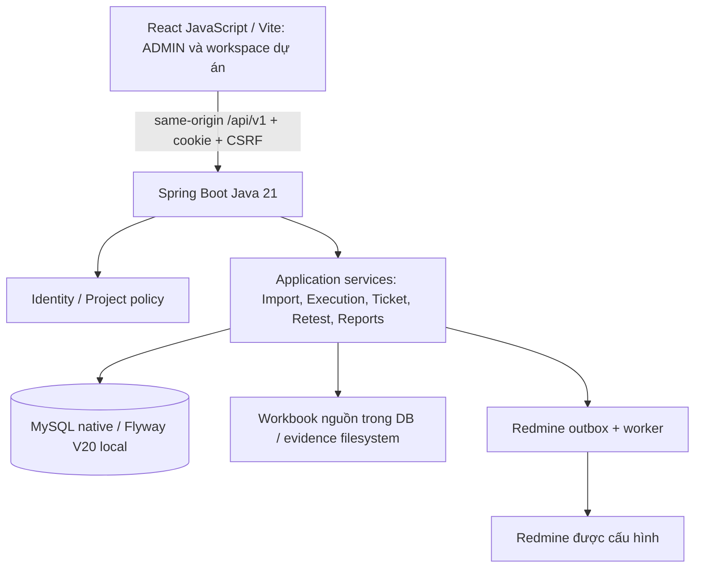
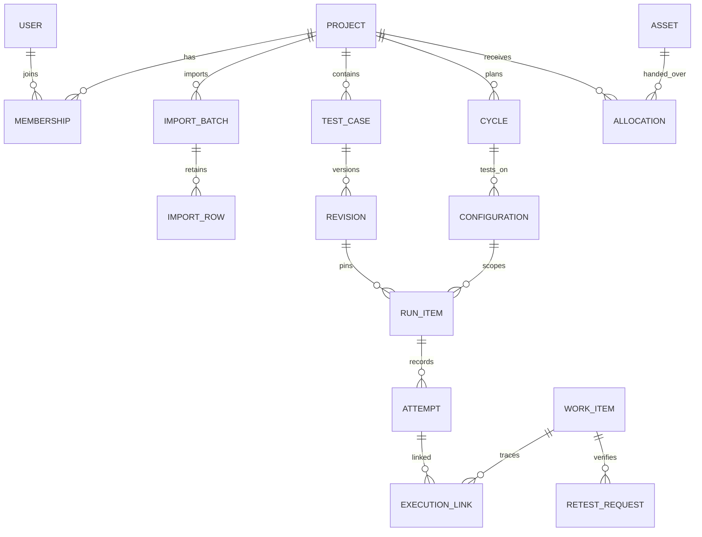

# Đặc tả chức năng và hệ thống TMS

Phiên bản **1.3 — 07/10/2026**, nhánh `system-design`. Phần 1–13 giữ baseline trước F/Q, gồm ADMIN A1–A4; phần 14 đặc tả F/Q và checkpoint trước nghiệm thu native. **Phần 16 cập nhật trạng thái hiện hành V20**, thay các ghi chú native/HTTP chưa thực hiện ở checkpoint cũ. Không coi source hoặc compile là nghiệm thu end-to-end.

Tài liệu sản phẩm: [PRD](PRD.md). Test/traceability: [UAT](TRACEABILITY-UAT.md). Cấu trúc đầy đủ 59 bảng/560 cột/139 FK/269 indexes: [DATA-DICTIONARY](DATA-DICTIONARY.md). Bằng chứng baseline: [review](../reviews/2026-10-06-system-workflow-review.md). Schema mở rộng theo mã nguồn: [FQ-DATA-DICTIONARY](FQ-DATA-DICTIONARY.md).

## 1. Mục đích, ranh giới và nguyên tắc

TMS quản lý dự án kiểm thử nội bộ, nội dung test, scope/assignment, kết quả, bug/retest, thiết bị và tiến độ. Công ty/ADMIN giao dự án; PM điều hành; Tester thực thi; Dev sửa bug; PM kiểm soát tồn đọng/chất lượng. Redmine là adapter được cấu hình, không thay TMS làm authority kết quả/closure.

Một hành vi chỉ được coi hoàn thành khi UI → API → permission → transaction/persistence → history → đọc lại/report/export cùng nguồn. Thay đổi nhãn UI không đủ. Các nghiệp vụ khách hàng chưa xác nhận không được suy từ mock, JSON nháp hoặc seed.

Các invariant:

1. Cách ly dự án ở server và FK nghiệp vụ; ID từ client không cấp quyền.
2. Actor từ principal và thời gian UTC từ server; không nhận người thực hiện do client tự khai làm authority.
3. Revision, attempt, verification và quyết định có lịch sử; sửa sai bằng bản ghi mới.
4. Một nguồn verdict chính thức là execution_attempts trên run/context. Annotation tài liệu V13 giữ riêng theo quyết định người dùng.
5. Dev báo sửa không làm case OK. Verification PASS không tự đóng bug hoặc pass bug khác.
6. Quản trị tổng không cấp ADMIN membership PM giả trong mọi dự án.
7. Command có version/idempotency theo contract; lỗi không tạo ghi một phần.
8. Dữ liệu cũ và workbook nguồn giữ nguyên qua migration mới; không sửa checksum migration đã áp dụng.

## 2. Kiến trúc và stack hiện hành



| Thành phần | Cấu hình/code hiện hữu |
| --- | --- |
| Frontend | React 18.3, JavaScript, Vite (build hiện tại 6.4.3), lucide-react, Chart.js; Vitest/Testing Library |
| Backend | Java 21, Spring Boot 3.5.16, MVC/Validation/Security/JPA/JDBC, Apache POI 5.5.1; JUnit/Mockito/MockMvc |
| Database | MySQL Server native `127.0.0.1:3307`, schema local `tms`; Flyway quản lý V1–V16; Hibernate không tự update schema |
| Đăng nhập | Spring Session JDBC, principal hiện hành, CSRF; Vite proxy về backend |
| Tệp | Workbook nguồn retained theo import batch, evidence UUID trong attachment root riêng |
| Kiểm tra | Tests ở Frontend/src và Backend/src/test; scripts contract/diagnostics/native runner; Testcontainers chỉ là công cụ test riêng |

Phiên bản dependency chính xác lấy từ [package.json](../../Frontend/package.json)/[pom.xml](../../Backend/pom.xml) và lockfile, không từ bảng trên khi có cập nhật. Không đổi React sang Next/TypeScript hoặc Spring sang Node vì ví dụ trong skill. Cấu hình mật khẩu/credential nằm ngoài mã được commit; tài liệu không chứa giá trị credential.

### Bản đồ source

| Module | Backend | Frontend |
| --- | --- | --- |
| M01 | identity, config, shared/web | features/auth, services/api |
| M02/M03 | admin, project | features/admin, features/projects |
| M04/M05 | catalog, rules, handbook, testcase | projects, test-cases |
| M06 | execution, cycle | test-execution, DocumentExecution |
| M07 | workitem, attachment | work-items, WorkBoardPage |
| M08 | retest | features/retest |
| M09 | reporting, admin/ProjectDeadlines/status reports, project/audit | reports, admin dashboard/audit, ProjectOverview |
| M10 | integration | features/integrations |

Dependency/capability map của phần mới ở PRD mục 4; phần F/Q chưa có implementation. Đặc tả này không phải kế hoạch thực thi module mới hoặc quyền chạy migration.

## 3. Actor và ma trận quyền

| Command/resource | ADMIN tổng | PM đúng dự án | TESTER đúng dự án | DEV đúng dự án |
| --- | --- | --- | --- | --- |
| Dashboard quản trị/danh sách mọi dự án/user/máy/audit | Có | Không | Không | Không |
| Tạo dự án/chọn PM/user/máy, quản lý membership/bàn giao | Có | Không | Không | Không |
| Tạo user | ADMIN/PM/TESTER/DEV | Chỉ TESTER khi được ủy quyền | Không | Không |
| Đọc case/tài liệu/cycle/ticket/report | Cần membership qua API nghiệp vụ | Có | Có | Có |
| Case/suite/import/cấu hình cycle | Có nếu membership và policy quản lý cho phép | Có | Không | Không |
| Approve revision/NA/chốt đợt/bug closure | Cần project role PM | Có | Không | Không |
| Ghi annotation tài liệu | Thành viên, không DEV, còn writable | Có theo guard | Có theo guard | Không |
| Execution/retest | Được giao, role membership PM/TESTER hợp lệ, không DEV | Được giao | Được giao | Không |
| Tạo BUG/log/link NG | Cần membership và đúng policy nguồn | Có | Có theo policy nguồn | Không |
| Triage/assignee/classification/batch | Cần project role PM | Có | Không | Không |
| Xử lý progress/resolved | Theo PM role | Có | Không | Chỉ BUG được giao chưa terminal |
| Bình luận/chứng cứ | Theo membership | Có | Có | Chỉ BUG được giao chưa terminal |
| Gửi status report | Cần project role PM | Có | Không | Không |
| Publish/retry/reconcile Redmine | Cần project role PM | Có | Không | Không |

Mọi quyền cần user enabled, session hợp lệ, membership active và đúng scope; archive khóa ghi theo policy. Global DEV giữ restriction kể cả membership cũ ghi PM. Role `MEMBER` có thể còn ở dữ liệu/contract cũ; không tự coi nó là TESTER hoặc cho execution. Dự án có PM nhưng PM bị khóa cần ADMIN xử lý; rule “PM cuối” không phải đảm bảo mọi tình huống vận hành tài khoản.

Các quyền tài liệu và quyền execution hiện khác nhau có chủ đích: annotation không yêu cầu assignee run vì không là execution. Nếu chuyển sang file execution, phải giữ `ExecutionService.record` guard, không dùng annotation endpoint để đi vòng.

Nguồn chính xác: [permissions](../business/permissions.md), IdentityService/ProjectService, WorkItemService, RetestService, CycleDecisionService. UI lấy capabilities metadata; lúc chưa có metadata không bật thao tác quản lý dựa trên project writable một mình.

## 4. Vòng đời và nguồn dữ liệu

| Đối tượng | Trạng thái/nguồn hiện hành | Tác động |
| --- | --- | --- |
| Tài khoản | enabled/disabled, global role | Thu hồi/kiểm lại phiên và quyền; không xóa actor lịch sử |
| Membership | active/inactive, project_role, lock_version | Chặn truy cập request tiếp theo khi bị gỡ; lịch sử còn |
| Project | active khi archived_at null / archived | Archive khóa writes nghiệp vụ, không xóa dữ liệu |
| Import batch | PREVIEW → COMMITTED; EXPIRED là trạng thái hiển thị khi staging quá hạn | Commit atomic; list tài liệu chỉ COMMITTED |
| Test case | Identity/current revision; revision có approval riêng; case archived | Run giữ revision đã pin; revision mới không tự approved |
| Annotation row | UNEXECUTED → OK → P → NG → FIXED → NA → UNEXECUTED | Tự lưu result/version/actor/time/history; không tạo attempt |
| Cycle | DRAFT → ACTIVE → CLOSED; PM reopen CLOSED → ACTIVE | DRAFT chuẩn bị scope, ACTIVE ghi, CLOSED khóa writes; history quyết định |
| Run | Không có attempt: NOT_RUN; latest attempt OK/NG/P; scope decision NA | NA là exclusion hiện hành, không là attempt; giữ lịch sử |
| Work item | open/progress/recheck/clarify/ready/planning/resolved; terminal unreproducible/wontfix/closed | BUG closure đi qua service retest, không generic terminal transition |
| Retest request | OPEN → SUBMITTED hoặc CANCELLED | Chỉ current coverage/round/fixed build hợp lệ được tính |
| Verification | PASS/FAIL, BUG_ONLY/FULL_CASE | Không đồng nhất PASS với auto-close; FULL_CASE thêm execution |
| Máy | AVAILABLE/MAINTENANCE/RETIRED; ALLOCATED là tình trạng suy từ allocation active | Một allocation active/máy, thu hồi ghi lịch sử |
| PM status report | Append-only, không state machine chỉnh sửa | Nội dung cập nhật không thay deadline/tỷ lệ thực tế |
| Redmine delivery | QUEUED/RUNNING/RETRY_WAIT/UNCERTAIN/DELIVERED/FAILED/CONFLICT/SUPERSEDED | Lease/reconcile chống gửi CREATE trùng, không tự sửa business verdict |

QA và trạng thái DOING của file **không nằm trong bảng trạng thái đã triển khai**. Không dùng P, progress của ticket hoặc sessionStorage để giả DOING đã được server lưu.

### Quy tắc bug hiện hành

- PM điều phối các trạng thái không terminal với lý do/version; Dev chỉ BUG của mình sang `progress`/`resolved`.
- `resolved` BUG cần build active cùng project và invalidates coverage vòng cũ; không tự tạo request retest.
- Khi sửa nội dung tái hiện/phạm vi/build hoặc reopen, verification cũ không được dùng để đóng vòng mới.
- Terminal đi closure riêng; FIXED cần đủ coverage PASS; UNREPRODUCIBLE/WONTFIX cần lý do/evidence/nguồn xác nhận theo policy.
- Ghi OK mới không tự đóng bug hoặc xóa NG trước. Non-BUG chưa có terminal closure hoàn chỉnh trong implementation hiện tại.

## 5. Use case chi tiết

### UC01 — ADMIN tạo và bàn giao dự án

**Tiền điều kiện:** ADMIN enabled, session/CSRF đúng; code dự án chưa tồn tại; PM và members được chọn enabled/role hợp lệ; máy sẵn sàng và version hiện hành.

**Luồng:** nhập code/name/timezone/mô tả → chọn ít nhất một PM + members Tester/Dev → chọn máy/người nhận/ngày dự kiến/ghi chú → submit. Server authorize/lock current accounts, kiểm code/roles/duplicate/member/máy; tạo project, memberships, allocations và audit cùng transaction. Response project detail/members/state dùng để đọc lại.

**Hậu điều kiện:** PM thấy đúng project trong workspace; ADMIN thấy project trong quản trị tổng. Creator không được auto-PM. Không thiết lập quota từ số người/máy ban đầu.

**Ngoại lệ:** thiếu PM, user role sai/disabled, duplicate member/code, machine allocated/maintenance/stale: trả 4xx, rollback toàn bộ; draft giữ để sửa. Archive/member update cần version; chặn PM cuối; concurrency dùng current locking reads thay snapshot entity cũ.

### UC02 — PM tiếp nhận, cấu hình và nhập Excel

PM thấy project mình tham gia, members/máy đang bàn giao. Chuẩn bị suite/catalog/build/môi trường/logical device/mốc theo policy. Import nhận file và parse an toàn, lưu PREVIEW/source/mapping/checksum/expiry; báo lỗi từng dòng. PM xem preview, chỉ commit khi tất cả hợp lệ. Commit kiểm lại dữ liệu project/suite/code và batch owner/expiry, ghi case/revision/target_case_id/COMMITTED/audit atomic.

File khách import theo header và tự tạo mapping theo adapter; template nội bộ có suite code phải tồn tại. Không tự coi nguồn có OK là execution đã chạy. Import/customer duplicate theo checksum/mapping có policy riêng tại TestCaseService; không đặt mục tiêu “mọi upload đều tạo file mới”.

**Sau import:** tài liệu hiển thị đúng tên file và rows; case cần PM approve revision trước khi thêm execution scope. Có case title trống được kế thừa, nhưng sourceCells/workbook vẫn giữ trống. Không dùng import thành công để suy đã được giao Tester.

### UC03 — Xem/sửa tài liệu và export

GET detail trả headers/columns/sourceCells/cells/case/revision/result/version. Bảng hiện đúng mapping và ô nhiều dòng. Nút số case/menu mở nội dung/revision/history. Annotation ban đầu UNEXECUTED, không sao chép OK/NG nguồn vào state mới. Mỗi lần bấm xếp hàng riêng row, PUT có status/expectedVersion/requestKey; server lock/authorize/writable và lưu audit cùng result. Refresh đọc lại source of truth.

`export?original=false` dùng source workbook + nội dung revision hiện tại + annotation mới đã lưu; giữ style/sheet/hyperlink ô không đổi, chỉ sửa mapped cell. Nếu cột tester có mapping và kết quả tài liệu đã được cập nhật, export ghi actor displayName theo policy hiện hữu. `original=true` trả bytes nguồn. Legacy thiếu source binary không thể tải original và có fallback export theo adapter.

Đây là annotation/export tài liệu. Chưa có export chọn cycle/build/run. Không sửa M/N, execution note hoặc tên Tester nguồn chỉ vì UI hiển thị một run khác.

### UC04 — PM chuẩn bị đợt và phân công run

PM tạo DRAFT cycle, chọn milestone nếu cần; thêm configuration environment/logical device/default build cùng project; thêm approved revisions (1–100/request) và assignee hợp lệ. Scope là run item/case/config/cycle; tạo run và lịch sử phân công atomic. Tối đa 50 config và 500 run/cycle. Activate khi có scope/config/assignee eligible; đóng băng nội dung scope/revision/config.

PM có thể phân công lại run còn cho phép với lý do/version; không sửa executor cũ. Chưa có command chọn nguyên file hoặc danh sách My files. Cycle mới dùng khi cần scope/revision mới, không âm thầm thay run đang chạy.

### UC05 — Tester ghi execution

**Tiền điều kiện:** project writable, cycle ACTIVE, run không NA, chính assignee hiện tại, user/membership enabled active PM/TESTER không DEV, build cùng project active.

Tester mở case revision pin và context; chọn OK/NG/P, actual/reason/evidenceReference, build thực tế. NG cần actual; P cần reason. POST có expectedVersion/requestKey. Server lock project trước data read, authorize, kiểm replay, scope/actor/version/context và tạo attempt_no mới, latest pointer/version/audit trong transaction. Snapshot lưu revision/executor/build/environment/logical device. Response saved attempt; UI/history/report đọc cùng run.

Retries cùng key/actor/run/payload trả attempt cũ. Khác payload/key reuse hoặc version stale báo conflict. Actor/time không lấy từ text client. Không có PATCH/DELETE attempt. Physical asset/session/file work status chưa có trong command.

### UC06 — Tester log bug, PM giao Dev

NG → lấy source context → form BUG có title/steps/expected/actual/build/env/device/revision. Server kiểm attempt NG và toàn ngữ cảnh khớp; create canonical work item/bug_details/link/history/counter/audit. BUG từ revision không có attempt được phép theo policy; bug không có case chỉ PM và standalone reason.

Tester không được chọn assignee/category/milestone/priority khác default để đi vòng triage. PM cập nhật assignment/classification với version/reason. Evidence upload riêng kiểm MIME/nội dung/kích thước/owner; comment nội bộ escaped. Tên/mã ticket truy vết ổn định. Request key chống tạo trùng.

QA hỏi/đáp chưa có; REQUEST không có nghĩa Dev đang được phép nhận/trả lời. Không tạo NG giả để mở câu hỏi.

### UC07 — Dev xác minh và báo sửa

Dev đọc BUG được giao chưa terminal, xem bước/build/context/evidence; ghi bình luận/thông tin đã kiểm thử. GET destinations gồm `progress`/`resolved` còn hợp lệ. Dev dùng progress để bắt đầu; resolved cần reason và fixed build. Server kiểm ownBug/effective role/version/build; save status/fixed build/history/audit, invalidate old retest khi cần. Không ghi execution, annotation, scope hoặc closure.

Dev không có command structured “không tái hiện/xin Tester kiểm lại” riêng; hiện ghi lý do/bình luận để PM điều phối recheck/clarify. Đây là giới hạn, không tự chuyển terminal bằng tài khoản Dev.

### UC08 — PM chuẩn bị retest, Tester xác minh và PM đóng

PM trên BUG resolved có fixed build xác nhận coverage revisions/list run, reason/version; tạo request theo cùng assignee/environment/logical device/build/current round. Queue Tester chỉ thấy request đã tạo, resolved chưa có request chưa là việc retest được giao.

Người submit phải đúng assignee eligible **PM hoặc TESTER**, không Dev, còn quyền và run/cycle/build/coverage hợp lệ. BUG_ONLY thêm verification; FULL_CASE gọi execution service tạo OK/NG mới. FAIL returns bug progress/cancels open requests/invalidates round; FULL_CASE FAIL liên kết NG mới. PASS không auto-close và không pass bug khác.

PM closure FIXED khi đủ current coverage PASS; ngoại lệ cần evidence/source/reason. Stale/partial/wrong build/actor/project bị chặn hoặc rollback cả submit+close khi có command atomic. Reopen giữ history và invalidates phạm vi/kết quả dùng cho vòng mới. File annotation không tự đổi vì retest; file execution projection cần F03.

### UC09 — PM và ADMIN theo dõi

PM xem project overview/work items, cycle/run/latest result, grouped cycle/assignee, bug/retest, reports và status report. Báo cáo lọc cycle/build hiện hữu; byAssignee là nhóm thống kê, **chưa có assignee query filter riêng**. ADMIN tổng hợp toàn schema qua API admin; Users/Devices/Audit lọc project tại trang.

Milestone deadline so due_on với ngày project timezone; thiếu due hoặc scopeCount=0 → INSUFFICIENT_DATA; còn unfinished và due<today → OVERDUE; còn lại NO_OVERDUE_WARNING. Scope ở rule deadline hiện là work items + cycles liên kết mốc, không là phần trăm case. PM report overdue cần delayReason/recoveryPlan; report append-only không sửa kế hoạch hoặc che cảnh báo.

PM quyết định NA/restore trong ACTIVE với reason/version/history. Chốt cycle không còn NOT_RUN/P trong scope, NG có link bug; có NG/open bugs/open retest thì ghi tồn đọng. CLOSED không có nghĩa toàn bộ bug closed; reopen có reason. Chưa có timeline DOING/file/physical machine hoặc handoff queue chi tiết.

## 6. Quy tắc import/mapping workbook

Adapter khách nhận header ở hàng đầu, normalize NFKD/bỏ dấu/lowercase/bỏ ký tự không chữ-số để **so khớp**, không sửa text nguồn. Alias được hỗ trợ là danh sách code, không AI đoán cột tùy ý.

| Header nguồn/alias | Trường mapping | Bắt buộc |
| --- | --- | --- |
| ID | sourceId | Có |
| Đối tượng test | titleVi | Có |
| Điều kiện tiên quyết / Điều kiện tiền đề | preconditionsVi | Không |
| Các bước test | stepsVi | Có |
| Quan điểm test | viewpoint | Không |
| Hạng mục xác nhận / Mục xác nhận | confirmation | Không |
| Kết quả mong đợi | expectedVi | Có |
| Ghi chú thiết kế | designNote | Không |
| iPad, iPad* | result | Không |
| Ghi chú thực thi, Ghi chú thực thi& | executionNote | Không |
| ID redmine | sourceReference | Không |
| Người test | tester | Không |
| Cột thêm/không tiêu đề | sourceCells, không tự ánh xạ semantic | Không |

Hai header cùng semantic bị 422; thiếu header bắt buộc bị 422. Giữ 14 slot tối thiểu cho legacy M/N, tối đa 64 cột có dữ liệu; giới hạn 500 dòng/5MiB/8000 ký tự ô theo adapter. Nội bộ TestCases là adapter khác, exact header/suite code. Title blank kế thừa previous nonblank khi có ID/dữ liệu hợp lệ; không ghi bù source cell.

Formula/error cell bị từ chối, không evaluate kể cả cột unmapped. Hyperlink chỉ HTTP/HTTPS/mailto hoặc document link; template/workbook không mặc định cho macro/external links. Merge khách chỉ nhận **ngang trên cùng một dòng dữ liệu**, không qua case identity/content/sourceReference, các ô phía sau không header/không dữ liệu; merge an toàn L:N trình bày có thể giữ. Merge qua nhiều dòng/ID/nội dung/header hoặc mất dữ liệu bị lỗi có địa chỉ vùng. Template nội bộ không nhận ô gộp. Không tuyên bố hỗ trợ tất cả ô gộp chỉ vì một mẫu đã parse được.

Export không tạo công thức từ text bắt đầu `=`, ghi string; ô đổi gỡ hyperlink cũ, ô không đổi giữ presentation khi có binary nguồn. Headers/columns/sourceRows lưu mapping để thay thứ tự không làm lệch export. Chi tiết [test-documents](../api/test-documents.md), TestCaseWorkbook/CustomerWorkbook/DocumentWorkbook.

## 7. Mô hình dữ liệu và quan hệ



Sơ đồ khái niệm rút gọn; FK/PK/unique/column type đầy đủ ở [dictionary](DATA-DICTIONARY.md)/migration. Các quan hệ N:N dùng bảng trung gian (memberships, work_item_execution_links, coverage_items, request_items…); không cần thêm bảng trung gian thứ hai chỉ vì quan hệ khái niệm vẫn N:N. History/current pointer có mục đích bất biến/truy vấn, không tự xóa vì số bảng nhiều.

| Nhóm | Dữ liệu chính / authority |
| --- | --- |
| Identity | identity_users, roles/permissions/delegation, audit/session; enabled/role/version/hash nội bộ |
| Project | projects, project_memberships, project_counters, project_audit; code/timezone/archive/version, actor/time |
| Catalog | builds, environments, devices, categories, milestones và rule/handbook versions; cùng project, archive/version theo resource |
| Library | test_suites, test_cases, test_case_revisions; stable case identity/current revision/approval actor/time |
| Import/documents | import_batches checksum/file/source binary/mapping/status/owner/expiry; import_rows raw source/target case/result_status/result_version/actor/time |
| Execution | test_cycles/configurations/run_items/assignments/execution_attempts; latest pointer, pinned revision, assignee, context/build/result/executor |
| Decisions | run_scope_decisions/cycle_decisions; append-only reason/actor/time/snapshot/current pointer |
| Work items | work_items canonical ID/key/type/status/priority/assignee/version; bug_details subtype; links/history/comments/evidence/references/clarifications |
| Retest | bug_retest_state, coverage_revisions/items, retest_requests/items, verification_attempts, closure_decisions; current round/build/pointers + immutable evidence |
| Inventory | device_assets identity/type/model/serial/OS/condition/version; device_allocations project/recipient/handover/return/current active asset uniqueness |
| Reporting | project_status_reports append-only; execution report/ADMIN aggregates là projections, không kho verdict thứ hai |
| Integration | Redmine bindings/deliveries/attempts/reconciliation và config routing snapshots; không có secret trong public projection |

### Audit/version/khóa

- Mutable aggregate giữ updated_at/by/version khi thiết kế resource áp dụng; history chỉ có created/occurred actor/time. Không thêm updated vào attempt để cho sửa lịch sử.
- Foreign key ghép project/id bảo đảm liên kết cùng project cho nghiệp vụ quan trọng; không chỉ dựa frontend filter.
- Native BIGINT trả về JSON numeric trong giới hạn ID an toàn JavaScript theo contract; không dùng số vượt safe integer như ID giả.
- Snapshot context giữ nhãn executor/build/env/device lúc execution; đổi tên catalog không viết lại lịch sử.
- UI current revision khác revision execution pin: phải hiển thị ngữ cảnh đúng, không ghép title mới với bước/expected cũ mà không chú thích.
- Kho máy vật lý không có FK vào attempt hiện tại. Không suy serial hoặc Tester đang cầm máy từ logical deviceId.

### Migration

V1 foundation → V2 identity → V3 catalogs → V4 library/import → V5 integrity → V6 execution → V7 work items → V8 retest → V9 scope/cycle decisions → V10 Redmine → V11 settings version → V12 retained document source → V13 persisted annotation → V14 DEV → V15 inventory → V16 PM reports. Chi tiết exact DDL ở `Backend/src/main/resources/db/migration`.

Chỉ tạo V mới cho F/Q sau duyệt. Nullable link/backfill rõ cho dữ liệu cũ; không chuyển source/annotation thành attempt hoặc ghi verdict thay Tester. Kiểm upgrade, fresh, restart, FK/check/index/rollback và preservation bằng schema cô lập. V16 đã áp dụng trước lượt audit; lượt này không có migration mới.

## 8. API hiện hành

Prefix `A=/api/v1`, `P=A/projects/{projectId}`. Session và CSRF theo identity; endpoint admin kiểm global ADMIN, endpoint project nghiệp vụ kiểm active membership. Không dùng GET để mutate. DTO/body/status/error đầy đủ tại contract liên kết; bảng dưới là inventory resource và các command trọng yếu, không thay schema máy đọc.

| Nhóm / path | Methods / command | Nội dung / quyền |
| --- | --- | --- |
| A/auth/csrf, auth/login, auth/logout, me | GET CSRF/me; POST login/logout | Session lifecycle, throttle login; actor principal |
| A/users, users/{id} | GET/POST; PATCH | Admin list/manage; PM delegated create TESTER; PATCH enabled/delegation/version |
| A/admin/overview, admin/projects, projects/{id} | GET | Admin real aggregates/list/detail; page/keyword/project filters |
| A/admin/projects | POST | `{project,members,devices?}`; ADMIN transactional initial allocation |
| A/admin/projects/{id} | PATCH | Metadata expectedVersion; ADMIN |
| A/admin/projects/{id}/members, members/{user} | GET; PUT/DELETE | Role membership/version; last-PM guard; delete deactivates |
| A/admin/users | GET | Filter project/keyword/global role/enabled/pagination; safe DTO |
| A/admin/device-assets, device-assets/{id} | GET/POST; GET/PATCH | Physical inventory ADMIN; asset fields/version |
| A/admin/device-allocations, device-allocations/{id} | GET/POST; PATCH return | Project/asset/history filters; handover/return version/condition |
| A/admin/audit | GET | Allowlisted audit rows/filter/cursor/page per contract |
| P/device-allocations | GET | Project current allocations, member read |
| P/status-reports; A/admin/projects/{id}/status-reports | GET/POST; GET admin | Member history, PM submit narrative; admin read |
| A/projects; P | GET project resources; legacy creation route policy at contract | Workspace membership list/detail; creation centralized ADMIN |
| P/catalogs/{kind}, catalogs/{kind}/{id} | GET/POST; PATCH/DELETE archive | Versioned project catalogs by manager; builds/devices/env/milestones/categories |
| P/bug-rule-versions…; P/handbook… | Read/create/version/publish per controller | Internal rule/handbook resource versions; no invented customer rule |
| P/test-suites, test-suites/{id} | GET/POST; PATCH/DELETE archive | Manager writes, parent cycle/project guard |
| P/test-cases, test-cases/{id} | GET/POST; GET | Library identity/current/history |
| P/test-cases/{id}/revisions… | POST revision; GET revision; POST approve | expectedCurrentRevisionId; only PM approves |
| P/test-cases/{id}/archive | POST | Preserve revision/history |
| P/import-previews/template, import-previews/{id}, commit | GET template/preview; POST multipart/commit | Preview owner scoped, validation/expiry/atomic import |
| P/test-documents, test-documents/{id} | GET | File summaries/details with source/current cells/mapping/results |
| P/test-documents/{id}/rows/{rowId}/result, result-history | PUT result; GET history | Annotation status/version/UUID key; member not Dev; separate from execution |
| P/test-documents/{id}/export | GET original=false/true | Updated document or original XLSX; not execution export |
| P/test-cycles, test-cycles/{id} | GET/POST; GET | List/create cycle, version/status |
| P/test-cycles/{id}/configurations, scope, activate | GET/POST configurations; POST scope/activate | Manager, DRAFT; approved revisions/assignee/version |
| P/test-cycles/{id}/run-items; P/run-items/{id} | GET | mine/pendingBug filters; pinned content/latest result |
| P/run-items/{id}/assignment, assignments, attempts | PUT assignment; GET histories; POST attempt | Manager assignment; execution actor assigned, ACTIVE, version/key |
| P/run-items/{id}/scope-decisions; test-cycles/{id}/decisions | GET/POST | PM NA/restore/close/reopen with reason/version/guards |
| P/work-items, metadata, overview, sources/{attempt} | GET/POST; GET metadata/overview/source | Pagination/type/status/search/classification; BUG source context |
| P/work-items/{id}, transitions, batch-transitions | GET/PUT; POST transitions/batch | PM triage; Dev own BUG progress/resolved only |
| P/work-items/{id}/execution-links, history, comments… | POST links/comment; GET history/comment | NG links idempotent; member/own Dev BUG permissions |
| P/work-items/{id}/external-reference, clarifications | PUT ref; POST clarification | PM, manual source/reconciliation metadata |
| Evidence routes | Upload/list/download/remove per work-item contract | Project scope, MIME/content/owner/limits/protected evidence |
| P/work-items/{id}/retest, retest-coverage, retest-requests | GET state; POST coverage/request | PM scope/assignee/current fixed build |
| P/retest-requests, retest-requests/{id}, results | GET queue/detail; POST results | Assigned eligible PM/Tester; BUG_ONLY/FULL_CASE |
| P/work-items/{id}/closure, reopen | POST | PM guarded terminal decisions |
| P/reports/summary, reports/export.xlsx | GET | Cycle/build/page filters, grouped assignee metrics/export |
| P/integrations/redmine, work-items/{id}/redmine… | GET state; POST delivery/reconcile/retry | PM, async202 snapshot/outbox, no remote auto-authority |

Máy đọc và body chính xác: [OpenAPI chính](../api/openapi.yaml), [admin](../api/admin.openapi.yaml), [admin management](../api/admin-management.openapi.yaml), [inventory](../api/device-inventory.openapi.yaml), [admin reports](../api/admin-reporting.openapi.yaml), [projects](../api/project-settings.openapi.json), [cases](../api/test-cases.openapi.json), [execution](../api/execution.openapi.json), [work items](../api/work-items.openapi.json), [retest](../api/retest.openapi.json), [reporting](../api/reporting.openapi.json), [Redmine](../api/redmine.openapi.json), [file-work](../api/file-work.openapi.json), [QA/handoff](../api/qa.openapi.json). F/Q có source riêng và contract cụ thể ở mục14; không suy rằng backend listener hiện tại đã phục vụ các path mới.

### Error và representation

ApiError có code/message theo common handler; không raw SQL/credential/customer source/remote payload. 401 chưa/không còn session; 403 CSRF/quyền; 404 không tồn tại/ngoài project theo endpoint; 409 stale/archive/state/idempotency; 410 preview expired; 413 file quá lớn; 422 semantic validation; 429 login throttle/Retry-After. Transport 400/405/415 vẫn có ý nghĩa riêng, không ép thành 500. Generic unexpected errors không báo thành công hoặc trả fake demo data.

Pagination khác nhau được giữ tương thích: admin/identity có `items,page,size,totalElements`; library/execution có `items,totalItems,page,pageSize,totalPages`. Frontend dùng adapter tương ứng, không nhầm keys khiến mất dữ liệu/trang. Size phổ biến 1–100, giới hạn field theo DTO cụ thể.

Time lưu UTC, API timestamp có offset Z, UI format theo project timezone; LocalDate deadline/expected return không giả là timestamp UTC. XLSX là binary attachment UTF-8 filename, no-store; original download không trả file path nội bộ.

## 9. Tính đúng giao dịch và cạnh tranh

| Command | Atomic / điều kiện cạnh tranh |
| --- | --- |
| ADMIN create project | Current selected identity locks + duplicate/code policy → project/member/initial allocation/audit cùng transaction |
| Project/member updates | Current account → project lock; scalar current projection/locking membership đọc mới nhất; conditional version update, PM count không từ stale RR entity |
| Document annotation | Project FOR SHARE trước auth/replay, row lock/version/status/history cùng transaction; concurrent row independent, role/archive change không vượt guard |
| Import commit | Project/batch policy/expiry + conflict recheck, tất cả cases/revisions/target links/status/audit cùng commit |
| Scope/assignment/execution | Project lock trước consistent reads; cycle/run expectedVersion; attempt/latest/version/audit; request checksum/actor/run chống replay sai |
| Ticket create | Counter/new work item/subtype/link/history/audit atomic, request key/checksum/actor |
| Retest/closure | Current coverage/round/build/context kiểm trong project transaction; FULL_CASE verification+attempt/link hoặc rollback cùng closure khi command atomic |
| Inventory | Asset current lock/version, allocation active uniqueness; return+condition+history/audit atomic |
| Status report | Current identity/project membership lock, overdue derived, request hash/actor; append narrative+audit |
| Redmine | Commit snapshot/outbox riêng, HTTP ngoài SQL transaction; lease/version/actor/config guard khi dispatch/finalize |

Không giữ transaction DB khi chờ upload/network. Evidence blob và metadata có reconcile/cleanup chứ không giả filesystem nằm trong SQL atomicity. Idempotency không được dùng để bỏ kiểm quyền hiện hành hoặc cho user đã bị khóa replay dữ liệu ngoài quyền. Các locking regressions có native tests nhưng gate native chưa chạy; không khẳng định race đã được runtime chứng minh từ mock.

## 10. Công thức báo cáo và deadline

Theo internal-v1/ADR-008:

```text
T = số run items trong scope bộ lọc, bỏ cycle DRAFT
NA = số run có exclusion hiện hành
D = T - NA
OK + NG + P + NOT_RUN = D
executedRate = (OK + NG) / D * 100
passRate = OK / D * 100
D = 0 => rates null
```

Không chọn build → latest attempt mọi build; chọn build → latest attempt **trên build đó** và run chưa test build đó vẫn NOT_RUN. Thống kê scope không tăng theo số attempt. Bug liên quan dùng distinct ID, không nhân theo links. AwaitingVerification hiện chủ yếu resolved bugs, chưa là detailed retest handoff queue. NA/bug state là current, asOf là snapshot read không tự cung cấp historical time travel.

ADMIN tổng hợp số user theo identity để không đếm trùng membership; project scope lọc người đang tham gia theo contract. Inventory grouped type/current allocation condition. Đọc bảng dashboard không tải source BLOB. Deadline thiếu dữ liệu được ghi đúng trạng thái, không suy “đúng hạn” từ thiếu scope. Scope quá hạn chưa hoàn tất yêu cầu narrative reason/plan nhưng không đổi due_on tự động.

Nguồn: [metrics](../business/metrics.md), ReportMetrics/ReportingService/AdminOverviewService/ProjectDeadlines. Công thức effort/velocity/forecast/slippage baseline chưa có; không bịa tỷ lệ dự án nhanh/chậm hoặc throughput từ annotation.

## 11. UI và hành vi lỗi

| Màn | Nội dung và thao tác |
| --- | --- |
| Login/account | Đăng nhập, session hết hạn, logout; lỗi chung không lộ account; user management đúng quyền |
| ADMIN dashboard | Tất cả dự án, metrics/biểu đồ/attention/inventory; không health/Flyway tab |
| ADMIN Projects/detail | All default, chọn project, create/edit/member/initial devices/report/read timeline; không quota/header global scope |
| ADMIN Users/Devices/Audit | Server search/page/project filter; tài khoản/bàn giao/history/audit safe |
| PM project overview/board/list | Recent work/canonical detail, tổng status/mốc, filter/nút create theo capability |
| Test documents/list/detail | File names, current/source columns, inline annotation, per-row autosave/history/export/source; scroll/focus |
| Case library/dialog | Suite/search/create/revision/approval/history; case menu giữ thiết kế đã khôi phục |
| Cycles/scope/runner | Configuration, approved scope, assignee, ACTIVE execution/context/history/NG bug actions/NA/decisions |
| Ticket detail | Structured bug context/status/assignee/comment/evidence/tracker/clarification/retest; Dev only allowed own BUG actions |
| Retest queue/detail | Người được giao, current scope/build, PASS/FAIL BUG_ONLY/FULL_CASE, warnings/history |
| Reports/settings | Cycle/build summary/export, catalogs/rules/handbook/members read/allocated machines/PM narrative |

Loading/empty/error/retry ở mỗi resource. Context switch loại bỏ response cũ không đúng project. Version conflict giữ draft và bắt đối chiếu; busy khóa double submit/đóng modal khi cần; không tự resend draft version mới. Modal aria role/label/focus trap/Escape/return focus; native wheel không bị global smooth-scroll chặn nested table/dialog. Bảng rộng horizontal scroll thay cắt column, labels/buttons đủ chiều cao, mobile không đẩy page overflow.

Annotation button cyclic có nhãn + màu, không form dưới bảng. Execution cần actual NG/reason P và NA quyền PM; không cho một vòng cyclic annotation ghi execution thiếu dữ liệu bắt buộc. History read-only không render create/link bug hay mời người không có quyền ghi. Các yêu cầu tương tác F/Q chưa hiện trong screen inventory đã có.

## 12. Bảo mật, tệp, tích hợp và vận hành

- Session/CSRF same-origin, current-account filter, project guards, không hardcode account ADMIN; không public signup/customer visibility chưa duyệt.
- Input validation limits/enum/type/owner/version, parameterized SQL; output text escaped, không render HTML nguồn tùy ý. Audit allowlist không trả password/hash/session IDs/API keys.
- Evidence kiểm content/size/type, UUID filename và owner/project khi download, nosniff/attachment/CSP/no-store theo implementation; protected closure evidence không gỡ bằng API thường. Không coi content validation là antivirus.
- Workbook parser không evaluate formula/macro/external links; export strings an toàn; source binary private. Danh sách không tải BLOB; log lỗi không in workbook/credential.
- Redmine endpoint/API key cấu hình server, không request URL từ user; HTTPS trừ loopback sandbox, không redirect, timeout/cap. Không auto-publish vì có bug/QA, không gửi evidence/identity secret không được duyệt.
- Native MySQL/Workbench là runtime chính; port/backend/front giữ trong config local, Docker không prerequisite. Môi trường release cần profile/config explicit theo [deployment](../deployment.md).
- Backup phải gồm MySQL, workbook source/evidence và cấu hình riêng; checkpoint DB-only không là fullrestore. Không seed/restore/clean/repair vào database sử dụng để test.
- SLA, retention, data residency, deletion/anonymization, RPO/RTO production chưa chốt. Mục tiêu load cũ là nội bộ có giới hạn, không SLA hiện hành.

Lệnh phát triển của người dùng:

```powershell
cd D:\DCN\KTN_11235645_DoCamNhung\Backend
mvn spring-boot:run
# Terminal riêng:
cd D:\DCN\KTN_11235645_DoCamNhung\Frontend
npm run dev
```

Backend8080/frontend5173 theo config local; đúng prefix `spring-boot`, không `springboot`. Cấu hình MySQL/Workbench: [hướng dẫn](../database/mysql-workbench.md); backend startup Flyway áp dụng V mới khi enabled/đủ quyền, không cần chạy CREATE TABLE thủ công, nhưng phải kiểm migration/backup/test trước. Lượt audit giữ listener người dùng, không tự restart để chiếm terminal.

## 13. Kiểm chứng và điều kiện hoàn thành

TDD bug: behavioral RED trước fix → targeted GREEN → phù hợp regression/build/diagnostics. Không đoán coverage từ test count. Tests integration có fixture chỉ chạy trên schema test cô lập; dùng guarded runner, không sửa config về `tms`. Negative tests đủ role/project/build/revision/actor/stale/replay/archive/resource revoked. Native concurrency/fresh migration và UI journey/UAT là bằng chứng riêng.

Lượt này: full FE344/344(44files); BE scoped26/26(6suites); build/package PASS; JDT167sources0error0warning; contract structural checker PASS. Native SELECT/metadata không là test ghi. S11 vẫn IN_REVIEW, không full-BE verify/new-feature native/E2E hoặc production acceptance. Chi tiết [UAT](TRACEABILITY-UAT.md).

Boundary: luôn giữ quyền/nguồn/history, test trước fix và ghi evidence; không reset data/migrations/secret hoặc tự push/deploy. Với F/Q phải duyệt nguồn dữ liệu/lifecycle, hợp đồng và kế hoạch cụ thể trước implementation; không sửa API published hoặc chạy V mới từ bản đề xuất.

## 14. Đặc tả bổ sung F/Q đã duyệt

Người dùng đã duyệt toàn bộ thiết kế và quyết định D-F1…D-Q3 ngày 06/10/2026 (“mình duyệt hết”). Phần này giữ architecture case/run hiện hữu và mô tả F/Q theo implementation đang được review. Resource, service, UI và migration V17/V18 đã có trong working tree; database sử dụng vẫn được quan sát ở V16. Tiến độ và bằng chứng tại [báo cáo triển khai](../reviews/2026-10-06-fq-implementation.md), [kế hoạch](../../tasks/plan.md) và [danh sách việc](../../tasks/todo.md). Không suy runtime/HTTP/UAT từ source hoặc từ việc duyệt.

### 14.1 Nhóm giao file và phiên thực thi

**Đơn vị giao việc đã duyệt:** group(project, document import batch, cycle, configuration, selected approved revision/run IDs). Document dùng ID batch, không filename; scope case dùng exact revision pin. Mỗi group MVP một Tester chính, lấy assignee từ canonical run assignments; group chỉ giữ nguồn/phạm vi, không là authority verdict/assignee thứ hai.

PM preview giao file liệt kê approved/unapproved/archive/duplicate/run đã có/limits; confirm atomic group+run+assignments+audit. Group items không nhân run/report khi cùng run được hiển thị từ nhiều view. Nếu run đang thuộc nhóm khác, trả conflict để PM chọn rõ thay vì tạo bản scope trùng. Config/scope DRAFT guard hiện có giữ nguyên, không tự thêm case vào ACTIVE. Phân công lại group cập nhật run assignments với lý do/version; nếu PM đổi riêng run gây mixed assignee, group phải hiển thị/kiểm lại và không mở phiên toàn file cho một người sai scope.

**Session:** session references project/group/executor membership/physical allocation, state/version/request key, start/pause/end server timestamps/reason/audit. Một group chỉ có một DOING; một physical asset chỉ có một DOING. Allocation phải active đúng project/người nhận, asset usable, logical config/platform compatible theo mapping được duyệt; không suy từ tên iPad string. Session snapshot lưu assetCode/serial/OS/recipient/build/config để thu hồi/đổi tên sau không viết lại lịch sử. Một Tester được làm nhiều group bằng các máy khác nhau.

| Session action | Điều kiện đã duyệt | Kết quả |
| --- | --- | --- |
| Start READY hoặc resume PAUSED | Đúng assignee, cycle ACTIVE, group scope hợp lệ, máy active cho mình và không DOING nơi khác | DOING, server time/current actor/asset, version/history |
| Pause DOING | Chính executor, version/reason | PAUSED, ghi lý do; không đổi verdict, giải phóng sử dụng active máy theo policy |
| Complete DOING | Không còn NOT_RUN/P trong scope; NG hiện hành có BUG đúng attempt/build theo D-F4 | COMPLETED/time/history; không pass/close release hoặc bug |
| Cancel/đóng phiên mất quyền/tài nguyên | PM có lý do/version; lịch sử cũ giữ | CANCELLED, blocked writes; không xóa attempts |

Đã duyệt: một người có thể làm nhiều file bằng các máy khác nhau; một máy và một nhóm chỉ có một phiên DOING. Resume giữ nguyên allocation/build. Thu hồi máy hoặc mất quyền chặn ghi mới; PM cancel có lý do, không tự hủy. Complete chặn NOT_RUN/P và NG chưa liên kết BUG đúng attempt/build; NA hiện hành được loại khỏi phạm vi áp dụng. Không tính giờ công từ pause hoặc inactivity trình duyệt; không ghi giờ công giả. Chia sẻ máy giữa Tester nằm ngoài MVP.

**Attempt theo session:** nullable `execution_attempts.file_work_session_id` để legacy còn đọc được; record mới từ group yêu cầu session DOING, actor/group/run/config/allocation khớp và các guard M06 cũ. Snapshot thêm actual asset. Mọi attempt vẫn qua ExecutionService; không chép annotation thành attempt/backfill actor giả. Reassign/revoke/archive/return asset giữa phiên phải revalidate trước write/replay theo policy; invalid session trả lỗi có cách giải quyết, giữ history/draft. Public legacy endpoint từ chối group-bound run bằng FILE_SESSION_REQUIRED. FULL_CASE retest đi entry nội bộ được bảo vệ, không có client-controlled origin bypass.

### 14.2 File execution view và export

Hai chế độ rõ ràng:

- **Tài liệu tham khảo**: current revision + annotation, endpoint/export hiện hữu, nguồn Excel retained.
- **Lượt kiểm thử được giao**: group/cycle/config/build, revision pinned, run verdict/assignee/session/máy/bug/retest, ghi qua execution. Mở file từ My work mặc định mode này theo D-F1 đã duyệt.

Không lấy `cells` current revision rồi chỉ thay cột iPad khi revision đã khác run pin; execution view phải lấy đầy đủ nội dung pinned case. NOT_RUN/OK/NG/P/NA được render theo official context; FIXED chỉ thể hiện trạng thái bug liên quan, không verdict. Annotation cyclic vẫn giữ trong mode riêng. NG/P yêu cầu fields tối thiểu, NA chỉ PM. History dưới số case có tabs revision pin/attempt/bug/retest/annotation/source đúng context, không đoán cycle từ filename.

Export execution chọn group+build/context, re-read saved data consistent; giữ source presentation/cột phụ khi có binary và overlay **pinned content + official result + executor + actual machine/build metadata**. Không overwrite original hoặc annotation table. Metadata sheet nêu source batch/group/cycle/config/build/asOf/definition để đối chiếu; unmapped cột nguồn giữ nguyên và label provenance rõ. File 500case/multiconfig không được cắt silently hoặc ghi nhiều verdict vào một cột không có context. “Xuất tài liệu cập nhật” và “Tải file gốc” tiếp tục nghĩa cũ.

### 14.3 PM file dashboard và handoff

Mỗi group row: documentName, Tester/canonical assignee hoặc mixed warning, cycle/config/build, current session state/machine/start/latest activity, totals NOT_RUN/OK/NG/P/NA, executed/pass rates, open bugs/retest state. My work lọc đúng actor ở server. PM filter file/người/state/cycle/build; overview snapshots/loading/error/retry, không hứa realtime khi chưa có polling/event design.

Handoff BUG resolved: classify Chờ PM chuẩn bị retest (không current coverage/request), Đã giao (OPEN current request), Đã xác minh một phần/Đủ PASS (current coverage), Phải làm lại (FAIL/invalidated). Link từ row tới retest panel/queue/ticket. PM chọn coverage/candidate và confirm command cũ; không tự mở request từ toàn case hoặc tự đồng nhất `awaitingVerification` count với Tester đã nhận việc.

### 14.4 QA/câu hỏi

Đã chọn loại **QA riêng** cùng work-item ID/counter/history/comment/evidence, subtype context question/answer references optional run/revision/document/group. Không bắt NG/actual/fixed build; optional source vẫn kiểm same-project/FK. Không dùng REQUEST subtype cho luồng QA đã duyệt.

Policy theo type dùng canonical work_item_statuses với nhãn QA riêng; **work_items.status_code là authority duy nhất**, không thêm status cạnh tranh trong qa_details. Metadata trả `statusesByType.QA`; quyền tạo là `canCreateQa` riêng, không suy từ generic `canCreate`. Mapping đã duyệt:

| Canonical / nhãn QA | Actor / điều kiện | Hành vi |
| --- | --- | --- |
| open — Câu hỏi mới | Tester/PM tạo; PM triage | Nội dung câu hỏi không trống, context optional validated |
| progress — Dev đang xác minh | Dev đang được giao, version/reason | Nhận xử lý; không mở quyền trên BUG/TASK/REQUEST khác |
| clarify — Cần bổ sung thông tin | Dev được giao yêu cầu cụ thể | Tester chủ câu hỏi trả lời nội dung; Dev tiếp tục progress theo command/policy |
| resolved — Đã trả lời | Dev được giao gửi câu trả lời/căn cứ | Lưu response version/history; không yêu cầu fixed build như BUG |
| recheck — Tester đã xác nhận | Tester chủ câu hỏi, trên đúng current answer version | Ghi xác nhận đã hiểu/đối chiếu; không tạo attempt hoặc auto-pass case |
| closed — PM kết thúc | PM, đã xác nhận đúng current answer hoặc ngoại lệ có reason | Closure QA riêng; không gọi coverage/bug closure |
| reopen về open | PM và lý do | Giữ câu trả lời/acceptance cũ, yêu cầu xác nhận lại phiên bản mới |

Các commands QA phải validate type/current assignment/actor/answerVersion và lịch sử bất biến. Answer/acceptance có nguồn/audit; đổi Dev hoặc answer không cho dùng acceptance cũ. Comment text không tự coi là authoritative answer/confirmation. Nếu câu hỏi phát hiện bug, tạo/link BUG có đủ fields/context thay đổi verdict chỉ qua execution; QA history/identity giữ lại. QA closed không tự đóng bug liên quan.

Không thêm customer account/acknowledgment hoặc mapping Redmine QA mặc định. Dev không tự triage/đóng QA/bug, Tester không gán Dev trực tiếp nếu D-Q2 chưa đổi. Non-BUG TASK/REQUEST/IMPROVEMENT cần closure policy riêng, không suy từ QA mapping này.

### 14.5 Contract và authority thao tác

Resource cụ thể và payload tại [file-work](../api/file-work.md) và [QA](../api/qa.md). Các endpoint đã có source; trạng thái kiểm thử xem checklist F/Q, không suy là đã hoạt động trên backend đang chạy. Tất cả write dùng CSRF + actor server + state/version/idempotency.

| Resource/command | Nội dung |
| --- | --- |
| File-work preview/create/read/list/assign | documentId/cycleId/configurationId/selected revision IDs/assignee/expectedVersions; preview errors/limits; group/explicit run IDs; mine filter server |
| Session start/pause/resume/complete/cancel | groupId/allocationId/build context/request key/version/reason; response actor/time/state/asset snapshot |
| File-work execution projection/export | groupId/buildId; pinned content/current verdict/attempt/history/provenance; consistent snapshot XLSX |
| PM file-work summary/handoff queue | Pagination/filter/context + ReportMetrics and coverage/request derived states |
| QA create/assign/start/request-info/answer/confirm/close/reopen | Work-item identity + source context/question/response/answerVersion/version/key/reason; type-specific permissions |

Status/error: 404 sai project/group/session/source; 403 wrong actor/role; 409 scope/assignment/machine/session/state/version/key conflict; 422 invalid question/result/limits/context; no partial writes. Removed actor/machine does not succeed because UUID/key existed. Pagination/source BLOB separation and deadline/timezone behavior giữ tương thích.

### 14.6 Persistence, migration và kiểm thử mục tiêu

DDL additive đã viết tại V17/V18: groups/items/sessions/commands/history và QA details/answers/confirmations/commands, cùng nullable session link trên attempts. [Từ điển F/Q](FQ-DATA-DICTIONARY.md) mô tả 9 bảng mới/98 thuộc tính/32 FK theo source. Group/run/cycle/config/document/session/allocation có composite FK/unique cùng dự án; current-active/role/state vẫn do service enforce. Một authority assignee/verdict/status; derived views không lưu authority kết quả cạnh tranh. Không backfill verdict/session/actor giả hoặc sửa migration đã áp. Chưa chạy native fresh/upgrade/preservation trên schema riêng, chưa áp V17/V18 lên database sử dụng.

Acceptance F/Q: giao file atomic/tái retry không trùng, chưa duyệt/vượt limit bị lỗi; My work isolate; start/machine race chỉ một DOING; revoke/reassign/return chặn write; execution view/export pinned/build đúng; BUG_ONLY không đổi case, FULL_CASE chỉ đúng run; QA không cần NG/fixed build, Dev own assignment, answer stale không confirm/close; PM dashboard/report/export không double-count. Kịch bản C01–C12/D08/D09/D15/E07 và negative matrix ở [UAT](TRACEABILITY-UAT.md).

Gate trước implementation: người dùng review phần F/Q/D-F*/D-Q* → module spec/API/state/data được duyệt → kế hoạch theo từng lát → RED/GREEN → native migration/races/export trên schema riêng → browser/UAT/pilot → ghi bằng chứng/STATUS. Không gộp nghiệp vụ chưa xác nhận vào một migration rồi coi database startup đủ nghiệm thu.

## 15. Bàn giao tài liệu và quyết định mở

Baseline hiện hữu đã đối chiếu source/contracts/metadata. Người dùng đã duyệt D-F1…D-Q3, gồm nguồn/chế độ file, QA riêng, group/Tester/máy/session/finish và handoff; implementation theo kế hoạch F/Q đã được phép. Phải giữ native migration/HTTP/UAT/pilot là gate độc lập. Quy mô/SLA/retention/RPO/RTO cần chủ vận hành quyết định riêng trước production.

PRD/đặc tả này là đầu vào review cụ thể. F/Q đã duyệt và các source gate được ghi riêng; native fixture/fresh/race/new journey và UAT còn thiếu. Chỉ khi criteria/test matrix đạt đầy đủ mới kết luận hệ thống đáp ứng trọn luồng ADMIN → PM → Tester → Dev → retest → PM trên môi trường vận hành.

## 16. Trạng thái xác minh hiện hành — 07/10/2026

Đoạn kết phần 15 và điều kiện native ở 14.6 là checkpoint lịch sử. Hiện native MySQL 3307 đã áp V17–V20. V19 bổ sung sửa composite FK QA sau kiểm thử thật; [native completion](../reviews/2026-10-06-native-completion.md) ghi migration, integration, concurrency và hành trình HTTP 37 bước đạt. [V20](../reviews/2026-10-07-demo-v20.md) bổ sung fixture demo local theo vai trò, có kiểm tra fresh/upgrade/preservation. Workbook được nhập bằng luồng riêng, không chứa trong migration seed.

Đợt responsive không thay contract API, quyền hoặc persistence. Control dùng chiều cao tối thiểu thay chiều cao cố định, nhóm thao tác có wrap/gap, bảng nhiều cột cuộn trong container; bảng tài liệu mobile có viewport đọc riêng. File work hiển thị nhãn dễ hiểu nhưng gửi mã trạng thái gốc; Hủy giao file chỉ đóng draft, không gọi create. Ba chế độ original/annotation/execution export giữ authority hiện có.

Bằng chứng mới: frontend 614 tests PASS, build PASS, 27 route × 6 viewport và kiểm tra form theo bốn vai trò; chi tiết/giới hạn ở [báo cáo responsive](../reviews/2026-10-07-responsive-product-review.md). Không chạy lại native writes trong đợt UI. UAT khách hàng/pilot, browser ngoài Chrome và NFR production vẫn riêng; notification, closure các loại ticket khác và archive command chưa tự mở rộng nghiệp vụ.

## 17. Vòng đời dự án và quyền công việc thường — 08/10/2026

Được người dùng duyệt sau checkpoint 16: archive/reopen ADMIN với readiness, version, lý do và requestKey. V21 thêm project_lifecycle_decisions, không sửa migration cũ hoặc seed thêm tài liệu. API quản trị kiểm tra tài khoản hiện hành và khóa dự án trong cùng transaction; lưu audit và quyết định nguyên tử, replay cùng actor/payload trả trạng thái hiện hành, không đảo ngược quyết định đến sau.

Blocker, quyền và hướng xử lý tại [quyết định vòng đời](../planning/project-lifecycle-2026-10-08.md). PM đóng công việc thường allowlist TASK/REQUEST/IMPROVEMENT thành closed/wontfix; mở lại terminal chỉ open, có lý do/version/history. Không nới BUG/QA typed guards hoặc quyền TESTER/DEV. DEV role khớp cả hệ thống và dự án.

Read projection trên màn case và inbox giữ DOM khi làm mới cùng phạm vi để không mất vị trí. Đổi project/filter/build phải đổi scope; phản hồi cũ bị bỏ qua. 401/403/404 xóa bản đọc cũ. Trạng thái đang tải/lỗi authority khóa ghi kết quả; lỗi mạng inbox giữ lần đọc gần nhất kèm cảnh báo và retry. Thông báo thành công không tự kéo trang; sau lưu case phục hồi focus bằng preventScroll. Workspace lưu trữ hiển thị banner chỉ đọc.

Kiểm chứng kỹ thuật, regression responsive và đánh giá mô phỏng khách hàng ghi tại [báo cáo](../reviews/2026-10-08-customer-reassessment.md); không thay UAT thực tế.
