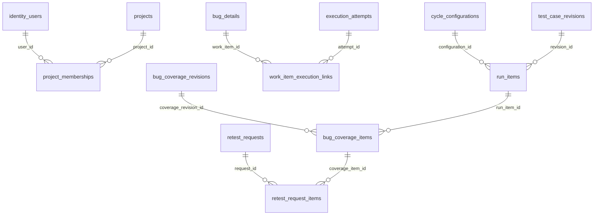

# Rà soát thuộc tính audit và quan hệ — 03/10/2026

Trạng thái: **đã phân tích, đề xuất đang chờ người dùng xem; chưa sửa schema/backend**. Đây là bước khám phá và đề xuất của skill `brainstorming`, chưa phải spec hoặc kế hoạch triển khai đã duyệt. S11 vẫn IN_REVIEW. Không commit/push, không ghi vào database.

## Phạm vi và nguồn kiểm tra

Người dùng yêu cầu bổ sung người/thời điểm tạo–sửa, biểu diễn quan hệ nhiều–nhiều qua bảng trung gian và dùng MySQL Windows/Workbench thay Docker. Giữ nghiệp vụ, dữ liệu và lịch sử hiện tại; không thêm bảng chỉ để đủ một mẫu thiết kế.

Đã đối chiếu [metadata V11](../database/erd/schema.json), V1–V11 trong `Backend/src/main/resources/db/migration`, các entity JPA và câu lệnh JDBC/service hiện hành. Metadata có **56 bảng, 514 cột, 128 ràng buộc FK**; mỗi FK đều tham chiếu đúng một khóa PK/UNIQUE đầy đủ trong snapshot. Không tìm thấy `@ManyToMany` hoặc `@JoinTable` trong Java hiện tại. Đây là kiểm tra mã nguồn/snapshot, không phải truy vấn dữ liệu trực tiếp trên native MySQL.

Chỉ `projects` và `work_items` có đủ bốn tên cột `created_at`, `created_by`, `updated_at`, `updated_by`. Điều này **không có nghĩa 54 bảng còn lại đều sai**: bảng sự kiện dùng actor/time riêng, bảng con dùng audit của bản ghi cha, bảng kỹ thuật do framework quản lý.

## Các phát hiện cần xử lý

1. **Bản ghi có thể sửa thiếu người sửa:** `project_memberships`, năm bảng cấu hình dự án, `test_suites`, `test_cases`, `rulesets`, `project_resources` có timestamps nhưng thiếu actor trên chính bản ghi. Audit chung có ghi sự kiện, nhưng muốn xem người sửa gần nhất phải truy lịch sử.
2. **Thiếu cặp người/thời điểm sửa:** `identity_users`, `test_cycles`, `run_items`, `retest_requests`. Đổi quyền, đổi phân công, ghi kết quả, quyết định NA và hủy retest đều có thể làm thay đổi các bảng này.
3. **Audit có cột nhưng một đường ghi bỏ sót:** `CycleDecisionService.invalidateCoverage()` cập nhật `work_items.updated_at` khi PM loại lượt khỏi phạm vi, nhưng không cập nhật `updated_by`. `work_item_history` vẫn ghi đúng actor. Cần test hồi quy và sửa writer, không cần thêm cột cho `work_items`.
4. **Tham chiếu ngoài ghi đè dấu vết tạo:** `WorkItemService.external()` upsert lại `recorded_by/recorded_at`. Hiện chúng là lần ghi gần nhất, không thể coi là tác giả/thời điểm tạo ban đầu. Cần bảo toàn lịch sử và phân biệt tạo với sửa ở hợp đồng mới.
5. **Worker Redmine khác người dùng:** `redmine_bindings` có nhiều lần worker cập nhật nhưng chưa có `updated_at`; `redmine_outbox` có `updated_at` và `dispatch_by`, song người yêu cầu gửi không phải người thực hiện worker. Không gán mọi cập nhật tự động cho PM.
6. **Chỉ thêm cột sẽ chưa đủ:** JPA callbacks không chạy cho JDBC UPDATE. Cần bao phủ cả `ExecutionService`, `CycleDecisionService`, `RetestService`, `BugRetestLifecycle`, `RedmineService/Worker` và các service dùng JPA.

Nguồn code: [IdentityUser](../../Backend/src/main/java/vn/syp/tms/identity/IdentityUser.java), [ProjectMembership](../../Backend/src/main/java/vn/syp/tms/project/ProjectMembership.java), [CatalogEntities](../../Backend/src/main/java/vn/syp/tms/catalog/CatalogEntities.java), [TestCaseEntities](../../Backend/src/main/java/vn/syp/tms/testcase/TestCaseEntities.java), [CycleDecisionService](../../Backend/src/main/java/vn/syp/tms/cycle/CycleDecisionService.java), [WorkItemService](../../Backend/src/main/java/vn/syp/tms/workitem/WorkItemService.java), [BugRetestLifecycle](../../Backend/src/main/java/vn/syp/tms/retest/BugRetestLifecycle.java), [RedmineWorker](../../Backend/src/main/java/vn/syp/tms/integration/RedmineWorker.java).

## So sánh cách bổ sung

| Cách | Ưu điểm | Hạn chế |
| --- | --- | --- |
| **Theo vòng đời bảng — đề xuất** | Bản ghi có thể sửa có audit trực tiếp; sự kiện giữ actor/time riêng; không tạo thêm bảng | Cần rà đủ các đường ghi và quy ước dữ liệu cũ |
| Thêm bốn cột giống nhau cho cả 56 bảng | Nhìn cấu trúc đồng đều | Thừa trên history, catalog cố định, bảng con; can thiệp bảng Spring/Flyway; dễ tạo audit giả |
| Chỉ dùng các bảng audit hiện có | Ít thay đổi DDL | Không đáp ứng tốt nhu cầu xem người/thời điểm sửa ngay trên bản ghi; thiếu dấu vết trực tiếp ở một số luồng |

## Hướng thiết kế đề xuất để người dùng xem

- Bản ghi nghiệp vụ có thể sửa: `created_at`, `created_by`, `updated_at`, `updated_by`; dùng `DATETIME(6)` UTC và ID có FK. Lúc tạo mới, hai cặp giống nhau; lần sửa thành công chỉ đổi cặp `updated_*`.
- Giữ tên cột hiện hành, không đổi hàng loạt `decided_by`, `executed_at`, `uploaded_by` thành tên chung. Chúng mô tả đúng hành động nghiệp vụ.
- `projects`, `identity_users`, `project_memberships`: actor là UUID trong `identity_users`; cách này hỗ trợ tạo dự án/thành viên đầu tiên trước khi có membership của actor. Các bản ghi nghiệp vụ trong dự án dùng BIGINT membership với FK ghép `(project_id, actor_id)` tới `project_memberships(project_id,id)`.
- Backend lấy actor từ session đã xác thực và thời gian từ server. Request DTO không cho client tự đặt audit. Một transaction ghi cả thay đổi, audit và version; lỗi quyền/version/validation phải rollback tất cả. Retry đã hoàn tất không thay audit lần nữa.
- Worker Redmine cần phân biệt `HUMAN`, `SYSTEM` và dữ liệu cũ chưa xác định, ví dụ `updated_source` cùng `updated_by` nullable. Giữ `dispatch_by` là người yêu cầu; không tạo tài khoản người dùng giả cho worker. Bootstrap Admin cũng phải được ghi rõ là bootstrap qua audit hiện có.
- Dữ liệu cũ: chỉ backfill từ sự kiện xác định được entity và actor; không tự gán Admin hiện tại hay thời gian chạy migration làm lịch sử thật. Trường chưa xác định để NULL, tài liệu hóa là legacy unknown. Khi cần suy luận nguồn từ revision/cha phải ghi quy tắc cụ thể trong spec; không coi `created_at` là lần sửa gần nhất nếu đã từng sửa.
- `bug_details` và `bug_retest_state` là phần mở rộng 1:1 của công việc: giữ audit chung ở `work_items`, kiểm chứng mọi đường thay đổi con đều cập nhật cha. Không nhân bản bốn cột cho ba bản ghi của cùng một hành động.
- Giữ `lock_version` cho chống ghi đè đồng thời; nó không thay thế audit. Không thêm soft-delete/version/index đại trà; giữ archive và các khóa đồng thời hiện có.
- Dự kiến migration tiếp theo là **V12** sau khi duyệt và kiểm chứng; không sửa checksum V1–V11. Chuyển từ server cũ sang native vẫn có thể thực hiện với V11, không cần chờ V12.

## Ma trận đủ 56 bảng

Cột “hướng xử lý” là đề xuất, **chưa áp dụng**. “Giữ” chỉ nói về audit trong phạm vi này, không khẳng định bảng đã được nghiệm thu toàn bộ.

| Bảng | Dấu vết hiện có | Hướng xử lý |
| --- | --- | --- |
| `identity_users` | `created_at`, `lock_version`, identity audit | Thêm `created_by`, `updated_by`, `updated_at`; quy ước bootstrap/legacy rõ ràng |
| `identity_roles` | Catalog do migration tạo | Giữ, không có màn sửa catalog |
| `identity_audit` | `actor_id`, `occurred_at` | Giữ sự kiện append-only |
| `identity_login_buckets` | `attempts`, `expires_at` | Giữ trạng thái chống dò mật khẩu, không gán actor người dùng chưa xác thực |
| `SPRING_SESSION` | Thời gian tạo/truy cập/hết hạn của Spring | Giữ schema framework |
| `SPRING_SESSION_ATTRIBUTES` | Thuộc session cha | Giữ schema framework |
| `projects` | Đủ bốn cột audit, `lock_version` | Giữ, kiểm chứng toàn bộ writer |
| `project_memberships` | `created_at`, `updated_at`, `lock_version` | Thêm `created_by/updated_by` UUID; đây đã là bảng trung gian |
| `environments` | `created_at`, `updated_at`, `lock_version` | Thêm `created_by/updated_by` membership |
| `builds` | `created_at`, `updated_at`, `archived_at`, `lock_version` | Thêm `created_by/updated_by` membership |
| `devices` | `created_at`, `updated_at`, `lock_version` | Thêm `created_by/updated_by` membership |
| `categories` | `created_at`, `updated_at`, `lock_version` | Thêm `created_by/updated_by` membership |
| `milestones` | `created_at`, `updated_at`, `archived_at`, `lock_version` | Thêm `created_by/updated_by` membership |
| `rulesets` | `created_at`, `updated_at` | Thêm `created_by/updated_by`; cập nhật khi đổi phiên bản áp dụng |
| `rule_versions` | `created_by/at`, `published_by/at` | Giữ; hiện tạo nội dung mới, chỉ bổ sung dấu xuất bản, không sửa đè nội dung |
| `project_resources` | `created_at`, `updated_at`, `archived_at` | Thêm `created_by/updated_by`; cập nhật khi đổi revision hiện hành |
| `resource_revisions` | `edited_by`, `created_at`, `published_at` | Giữ revision mới cho mỗi lần sửa; hiện công bố cùng lúc tạo revision |
| `project_counters` | Bộ đếm tăng trong transaction nghiệp vụ | Giữ; không cần audit người sửa bộ đếm riêng |
| `project_audit` | `actor_id`, `occurred_at` | Giữ append-only |
| `test_suites` | `created_at`, `updated_at`, `archived_at` | Thêm `created_by/updated_by` membership |
| `test_cases` | `created_at`, `updated_at`, `archived_at` | Thêm `created_by/updated_by`; gồm đổi revision/archive/import |
| `test_case_revisions` | `created_by/at`, `approved_by/at` | Giữ; code tạo revision mới và ghi duyệt, không cập nhật nội dung revision cũ |
| `import_batches` | `imported_by`, `created_at`, `committed_at`, hạn staging | Giữ audit theo sự kiện; commit hiện bắt buộc đúng chủ batch; nếu đổi quyền commit sau này phải thêm `committed_by` |
| `import_rows` | `created_at`, FK batch | Theo audit batch; `target_case_id` chỉ gắn trong transaction commit batch |
| `test_cycles` | `created_by/at`, `activated_by/at`, `lock_version` | Thêm `updated_by/at`; gồm cấu hình, phạm vi, kích hoạt, chốt/mở lại |
| `cycle_configurations` | `created_at`, FK cycle | Thêm `created_by` vì actor cấu hình có thể khác người tạo cycle; chưa có luồng sửa configuration |
| `run_items` | `created_at`, `lock_version`, con trỏ attempt/quyết định | Thêm `created_by`, `updated_by/at`; gồm phân công, kết quả và NA |
| `execution_attempts` | `executor_membership_id`, `executed_at` | Giữ append-only |
| `run_item_assignments` | `assigned_by`, `assigned_at` | Giữ sự kiện phân công |
| `run_scope_decisions` | `decided_by`, `decided_at` | Giữ sự kiện NA/khôi phục phạm vi |
| `cycle_decisions` | `decided_by`, `decided_at` | Giữ sự kiện chốt/mở lại |
| `cycle_statuses` | Catalog migration | Giữ |
| `execution_results` | Catalog migration | Giữ |
| `work_items` | Đủ bốn cột audit, `lock_version` | Giữ cột; sửa writer NA thiếu `updated_by`, kiểm tra các thay đổi con |
| `bug_details` | FK 1:1 tới work item | Dùng audit công việc cha, không nhân bản |
| `work_item_execution_links` | `linked_by`, `linked_at` | Giữ; bảng trung gian có actor/time đầy đủ |
| `work_item_comments` | `author_membership_id`, `created_at` | Giữ; hiện chưa có chức năng sửa bình luận |
| `work_item_attachments` | `uploaded_by`, `uploaded_at` | Giữ metadata upload; không thêm trường sửa giả |
| `work_item_history` | `actor_membership_id`, `occurred_at` | Giữ append-only |
| `work_item_clarifications` | `recorded_by/at`, `confirmed_by/at` | Giữ; người xác nhận có thể là nguồn bên ngoài, khác actor nội bộ ghi nhận |
| `work_item_external_references` | `recorded_by/at` bị upsert | Giữ `recorded_*` là cặp tương đương người/thời điểm sửa gần nhất; thêm `created_by/at` cho dấu vết tạo, backfill từ history khi có bằng chứng. Không thêm cả `updated_*` để rồi lưu trùng nghĩa |
| `work_item_statuses` | Catalog migration | Giữ |
| `work_item_policy_versions` | Catalog policy migration | Giữ trong phạm vi audit; vai trò JSON policy là việc review riêng |
| `bug_retest_state` | Trạng thái hiện hành, FK bug 1:1 | Dùng audit công việc cha; kiểm chứng mọi caller của lifecycle |
| `bug_coverage_revisions` | `created_by`, `created_at` | Giữ revision bất biến |
| `bug_coverage_items` | FK coverage revision | Audit qua revision cha; các mục tạo cùng transaction, không sửa lẻ |
| `retest_requests` | `created_by/at`, `submitted_by/at`, `lock_version` | Thêm `updated_by/at`, bao phủ cả hủy do build/scope/reopen thay đổi |
| `retest_request_items` | FK request và coverage item | Audit qua request cha; không sửa lẻ |
| `bug_verification_attempts` | `verified_by`, `verified_at` | Giữ kết quả append-only |
| `bug_closure_decisions` | `decided_by`, `decided_at` | Giữ quyết định append-only |
| `redmine_bindings` | `created_by/at`, `observed_at`, `lock_version` | Thêm thời điểm/nguồn sửa; actor nullable cho worker, không dùng `observed_at` thay mọi loại cập nhật |
| `redmine_outbox` | `created_by/at`, `dispatch_by`, `updated_at`, lease/retry | Phân biệt nguồn sửa human/system và actor; giữ người yêu cầu gửi riêng |
| `redmine_delivery_attempts` | `actor_membership_id`, `occurred_at` | Giữ log attempt; làm rõ actor là người yêu cầu dispatch, worker là bên thực hiện |
| `application_info` | `installed_at` | Giữ singleton và khóa bootstrap Admin |
| `foundation_checks` | `created_at` | Giữ tạm trong V11; đề xuất bỏ diagnostics nằm backlog riêng |
| `flyway_schema_history` | Thông tin version/install của Flyway | Không sửa schema/history bằng nghiệp vụ |

## Quan hệ nhiều–nhiều đã có bảng trung gian

Về nghiệp vụ, một người vẫn có thể thuộc nhiều dự án và một dự án có nhiều người. Về lưu trữ, quan hệ đó đã thành **hai quan hệ 1–N**. Không cần tạo thêm một bảng nối thứ hai.

| Hai phía nghiệp vụ | Bảng trung gian hiện tại | Khóa chống trùng thực tế |
| --- | --- | --- |
| Người dùng — dự án | `project_memberships` | UNIQUE `(project_id,user_id)` |
| Cấu hình đợt — test case | `run_items` | UNIQUE `(project_id,cycle_id,configuration_id,test_case_id)`; revision được ghim bằng FK |
| Bug — lần thực thi | `work_item_execution_links` | PK `(project_id,work_item_id,attempt_id)` |
| Phiên bản phạm vi retest — lượt kiểm thử | `bug_coverage_items` | UNIQUE `(coverage_revision_id,run_item_id)` |
| Yêu cầu retest — mục phạm vi | `retest_request_items` | PK `(project_id,request_id,coverage_item_id)` |

`cycle_configurations` cũng biểu diễn tổ hợp cycle/environment/device, UNIQUE `(project_id,cycle_id,environment_id,device_id)`; build mặc định là FK. Giữ các FK ghép chứa `project_id` để database ngăn liên kết khác dự án.

Không tìm thấy quan hệ nhiều–nhiều nào trong các luồng đã rà cần thêm bảng trung gian. JSON chứa nội dung/snapshot/rule/payload không tự động là quan hệ thiếu chuẩn hóa; cần xét ngữ nghĩa, không tách mọi JSON thành bảng.

## Điều kiện trước khi coi triển khai hoàn tất

Spec được duyệt cần chốt cụ thể actor/system/legacy và tương thích các cột `recorded_*`. Kế hoạch tiếp theo phải bao gồm migration nâng V11 có dữ liệu và cài sạch, test actor từ session, FK khác dự án bị từ chối, khóa chống trùng, rollback, idempotency, bootstrap, JPA/JDBC, NA→hủy retest, worker Redmine. Kiểm thử database dùng schema kiểm thử riêng; không dùng `tms` người dùng làm nơi reset dữ liệu.

`Initialize-NativeMySql.ps1` hiện kiểm tra cứng 56 bảng/V11: khi có V12 phải cập nhật kiểm tra phiên bản, runbook, metadata và ERD cùng đợt. Không tự tăng bản ERD hiện tại khi migration chưa được kiểm chứng. Không khẳng định test PASS hoặc coverage cho thay đổi chưa viết.

## Kết nối native MySQL độc lập với đề xuất schema

Đã kiểm tra lại: service `MySQL97` Running, listener 3307, cấu hình `my.ini` có `port=3307`, Workbench đã cài, chưa có `.env.mysql.local`. Không thấy listener 3310 hoặc 8080 trong lần kiểm tra. Chưa xác thực native MySQL nên **chưa biết schema trên đó, chưa import, chưa cutover**.

Hai bản backup SQL cục bộ có SHA-256 khớp manifest. Bản `2026-09-30T17-43-20-832Z-tms.sql` ghi rõ nguồn cũ 3310; bản `17-53-59-969Z` chỉ ghi nhãn generic “native MySQL”, nhãn đó không chứng minh đã chuyển sang 3307. Cần chọn snapshot có nguồn/thời điểm phù hợp; không tự coi bản backup cũ là dữ liệu mới nhất. Không in nội dung hoặc tài khoản trong backup ra chat.

Thao tác cụ thể và nhánh không cần bật Docker: [Hướng dẫn MySQL/Workbench](../database/mysql-workbench.md). `Initialize-NativeMySql.ps1 -PlanOnly` chạy thành công, không ghi dữ liệu. Các bước xác thực/import/start/audit vẫn cần thực hiện tại máy với mật khẩu MySQL được nhập trong terminal.

Skill đã áp dụng: `brainstorming` (phân loại Architectural, khảo sát, so sánh phương án, trình thiết kế); `using-superpowers` (đọc workflow). Chưa gọi skill triển khai, chưa migration/test hành vi mới; đây là bằng chứng review chứ không phải bằng chứng hoàn tất V12.
