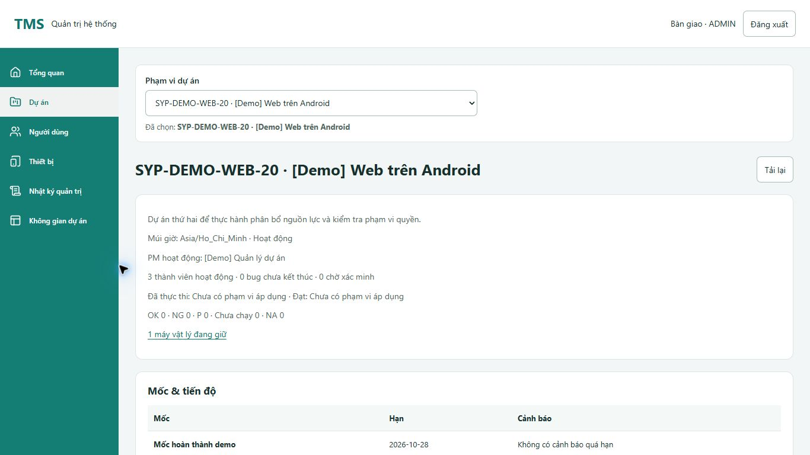
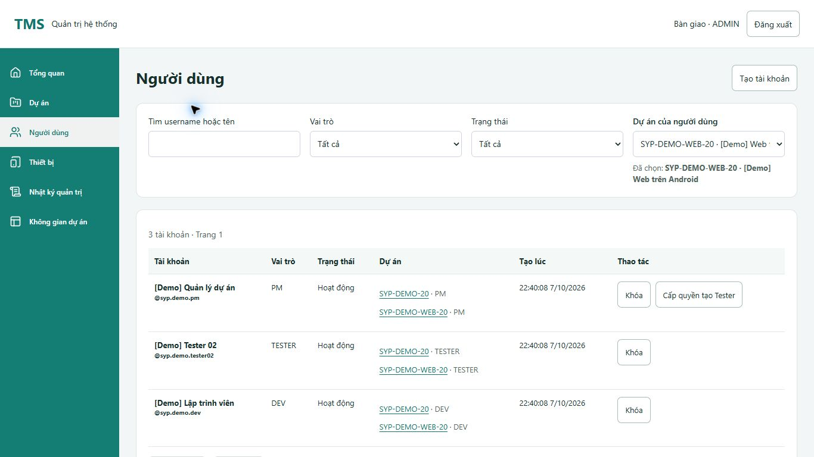
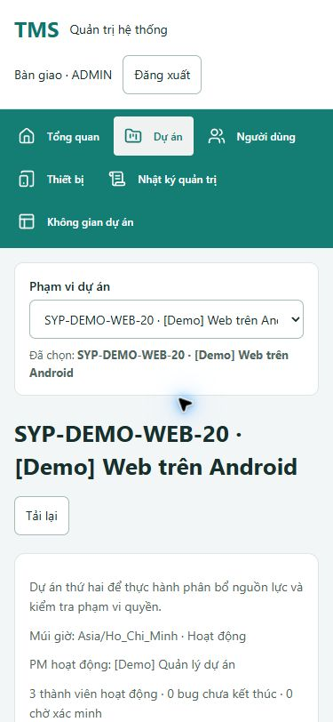

# Bộ chọn dự án và đánh giá thao tác khách hàng — 07/10/2026

Tiếp nối yêu cầu sửa ảnh “Phạm vi dự án” và đánh giá sản phẩm dưới góc độ khách hàng. Nhánh `system-design`. Phạm vi triển khai là các luồng có sẵn: chọn dự án Admin và tìm công việc theo file; không bổ sung rule nghiệp vụ chưa chốt.

## Lỗi đã xác nhận và sửa

1. **Nhãn Phạm vi dự án tụt xuống đáy ô chọn.** CSS `align-items:flex-end` của lần sửa trước là nguyên nhân. Trước sửa, nhãn bắt đầu y=150.4 trong khi ô chọn bắt đầu y=126. Bỏ bộ chọn riêng và CSS `admin-scope`, dùng cùng bộ chọn dự án với Người dùng/Thiết bị/Nhật ký/Bàn giao. Nhãn ở trên, chữ 14px, control cao 44px, rộng tối đa 560px tại màn Dự án và co theo vùng chứa trên mobile.
2. **Tên dự án dài bị cắt trong native select.** Giữ select chuẩn để dùng bàn phím; bổ sung tên đầy đủ xuống dòng dưới ô chọn, liên kết `aria-describedby`. Không làm một dropdown tùy biến chỉ để xử lý chuỗi dài.
3. **Tên dự án bị mất hoặc nhầm khi đổi trang/đổi lựa chọn.** Bộ chọn cũ ở tab Dự án mất tên khi phân trang; bộ chọn dùng chung có thể lấy tên cũ gắn vào ID mới trong lúc lookup chờ. Nay giữ lựa chọn có đúng ID, dùng fallback ID khi chưa có tên và bỏ phản hồi không còn hiện hành. Phạm vi do từng trang sở hữu; chọn Tất cả dự án vẫn về danh sách tổng.
4. **Các trường lọc bên cạnh bị kéo cao khi có dòng mô tả.** Trong kiểm tra sau thay đổi, ba ô lọc Người dùng bị kéo lên 68.5px, lệch với ô dự án 44px. Sửa grid căn theo đầu hàng và thống nhất gap nhãn/control. Kiểm tra lại tại desktop: cả bốn ô cùng y=219.59, cao 44px.
5. **Tìm không có kết quả nhưng thông báo giống chưa có dữ liệu.** Màn công việc theo file nay phân biệt “Không có file khớp với bộ lọc hiện tại” và trạng thái chưa có công việc. Thêm Xóa bộ lọc cho từ khóa/trạng thái/người/đợt/build, reset phân trang, trả focus về tìm kiếm. Giữ dự án, document scope và lựa chọn Được giao cho tôi, không mở rộng phạm vi công việc chỉ vì xóa lọc.

Các vấn đề 3/5 được tái hiện bằng bốn test hành vi thất bại trước sửa; test phân trang đã được chỉnh locator để thất bại đúng vì mất tên, không chỉ khác tên nút. Sau sửa bốn test đều PASS.

## Bằng chứng

- Admin + File-work: **141/141 tests PASS**; frontend toàn bộ **618/618, 49 files PASS**. Coverage chưa đo trong đợt này.
- Build PASS; vẫn có cảnh báo JS bundle >500kB. Không coi đây là đợt tối ưu hiệu năng.
- Chrome: màn dự án ở 320×640, 375×812, 768×1024, 1024×768, 1366×768, 1920×1080, 667×375. Người dùng, Thiết bị, Nhật ký, form Bàn giao ở bốn viewport đại diện: tổng **23 trạng thái bộ chọn**. Đã kiểm tra nhãn phía trên, control trong vùng chứa, cao 44px và không tràn toàn trang.
- Kiểm tra thêm vị trí/chiều cao các trường lọc bên cạnh, không chỉ bản thân bộ chọn. Màn file-work ở bốn viewport; PM tìm rỗng rồi xóa lọc bằng bàn phím, hai file hiện lại và search nhận focus.
- Admin chọn Tất cả dự án thực sự về `#/admin/projects`. Form bàn giao chỉ mở/chọn thử rồi hủy. Không sửa dự án, quyền, thiết bị, file hoặc kết quả kiểm thử trên database trong lần kiểm tra này; không có migration/backend change.
- [Số đo DOM](assets/2026-10-07-project-scope-checks.json). Đây là kiểm tra Chrome local, không thay cho Safari/Firefox, thiết bị thật hoặc UAT khách hàng.

## Đánh giá khách quan từ hành trình khách hàng

**Nhận định:** luồng nghiệp vụ chính đã được xây dựng theo yêu cầu; mức hoàn thiện thao tác chưa đồng đều. Người dùng vẫn phải nhớ nhiều bước, còn chỗ dùng mã nội bộ và phải chủ động kiểm tra bàn giao. Có thể tiếp tục pilot nội bộ có hướng dẫn; chưa đủ bằng chứng để gọi là sản phẩm đã nghiệm thu cho vận hành thực tế.

| Người dùng muốn đạt điều gì? | Hệ thống hiện đáp ứng đến đâu? | Điều cần cải thiện |
| --- | --- | --- |
| Admin biết mình đang quản lý đúng dự án/người/máy | Có quản trị tập trung, scope và phân quyền, dữ liệu demo theo role | Đã sửa lệch nhãn, tên dài và nhầm tên khi lookup; chọn dự án phải ổn định cả khi danh sách trên 100 dự án. |
| PM tiếp nhận, nhập file, giao đúng người và theo sát | Có import, duyệt revision, đợt/build, giao file, dashboard và báo cáo PM | Xóa lọc và empty state đã sửa. Bước chuẩn bị còn phân tán: nên có checklist đi tới bước thiếu, dựa dữ liệu đã lưu và quyền hiện hành. |
| Tester biết việc nào, file nào, máy nào cần làm | Có My work, phiên làm việc, máy/build và lịch sử kết quả | Giữ My work khi xóa lọc đã kiểm chứng. Còn cần giải thích các mã cấu hình/revision bằng tên dễ đọc; tiếp tục UAT các trường hợp bị chặn và khôi phục sau lỗi mạng. |
| Dev nhận bug/câu hỏi, trả lại cho Test kịp thời | Có BUG/QA, phân công, xử lý/trả lời và lịch sử | Chưa có thông báo trong ứng dụng; bàn giao vẫn phụ thuộc việc người nhận chủ động mở màn hình. |
| PM chốt chất lượng dựa trên dữ liệu đáng tin | Có execution, retest, coverage/closure và báo cáo; ba nguồn Excel riêng đã chốt | Cần nghiệm thu có người thực hành: file tham khảo khác kết quả thực thi; hoàn thành phiên khác đóng bug và chốt đợt. |

Đối chiếu implementation/native: [PRD mục17](../product/PRD.md#17-checkpoint-hiện-hành-native-v20-và-trải-nghiệm-đa-kích-thước), [native completion](2026-10-06-native-completion.md), [V20](2026-10-07-demo-v20.md). Các kiểm thử backend đã ghi trong những báo cáo đó, không chạy lại và không nhận là kết quả mới của đợt UI này.

## Thứ tự cải tiến đề xuất

1. **Chuẩn bị dự án/giao file có chỉ dẫn theo dữ liệu thật.** PM nhìn thấy bước thiếu (file đã nhập, case đã duyệt, đợt/cấu hình, Tester, máy) và đi đúng màn xử lý; Tester thấy lý do chưa thể bắt đầu. Dùng các quyền hiện hành, không tự cấp quyền hoặc duyệt case. Tiêu chí: PM mới có thể nhận dự án và giao file mà không cần nhớ chuỗi menu.
2. **Nhắc việc bàn giao trong ứng dụng.** Ưu tiên giao file, câu trả lời QA và yêu cầu retest; có người nhận, liên kết đúng context, trạng thái đọc, chống lặp và kiểm tra quyền khi mở. Cần chốt loại sự kiện/người nhận; không tự bật gửi email hoặc công bố ra Redmine.
3. **Hoàn chỉnh quy trình các loại ticket và kết thúc dự án.** REQUEST/TASK/IMPROVEMENT còn cần luật đóng/mở lại riêng; archive dự án phải giải quyết phiên/máy/ticket đang mở. Không lấy luật BUG/QA thay thế.
4. **Pilot và khả năng vận hành.** Chọn dự án đại diện, cho bốn vai trò thực hành, đo số lần cần trợ giúp và đối chiếu export; sau đó chốt trình duyệt, quy mô, backup/restore/retention. Tách bundle sau khi đo tải trang, không suy tốc độ từ việc build PASS.

Mục 1–4 là hướng cải tiến có tiêu chí, chưa phải tính năng mới được hoàn tất trong commit này. Bản sửa hiện tại giải quyết các lỗi xác nhận được trong luồng sẵn có; backlog cần rule mới vẫn được ghi rõ, không tự bịa quy trình của khách.

Skills: `brainstorming` cho phân loại thay đổi có phạm vi rõ và đối chiếu ý định; `ponytail` cho tái sử dụng bộ chọn/native select, sửa nguyên nhân và không thêm thư viện. `prompt-master` được đọc theo yêu cầu; skill này chỉ áp dụng khi tạo/chỉnh prompt, nên không thay tác vụ sửa code bằng đầu ra prompt. Kế thừa checklist UI từ lần review trước. S11 giữ IN_REVIEW cho UAT/pilot.
