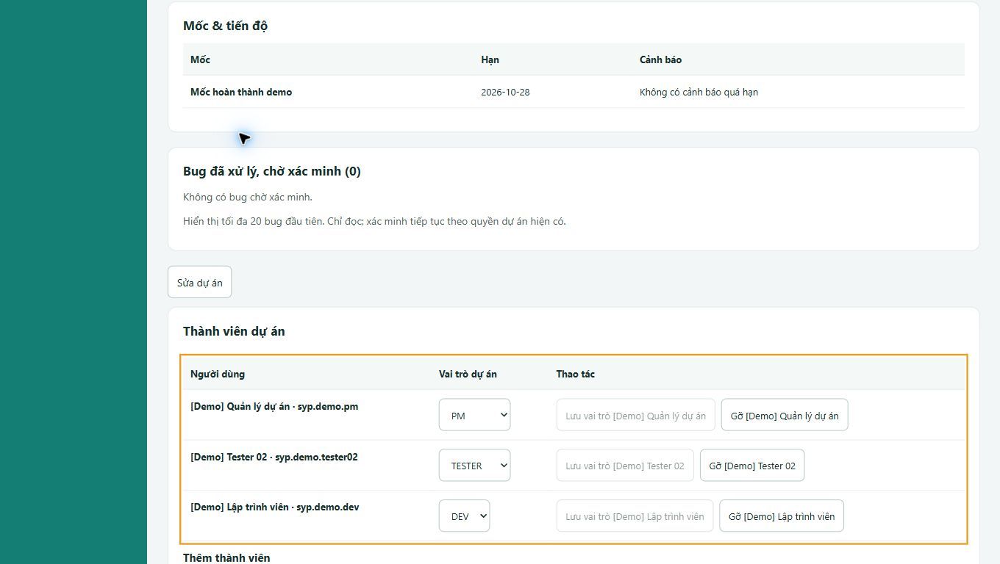
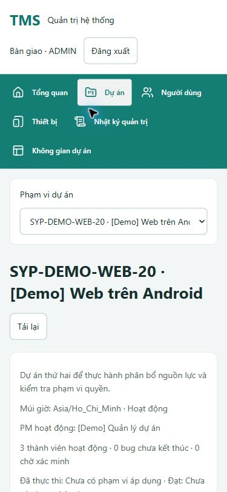

# Rà soát responsive và trải nghiệm sản phẩm — 07/10/2026

Nhánh `system-design`. Phạm vi mở rộng theo yêu cầu người dùng: Admin và toàn bộ nhóm màn nghiệp vụ hiện hành, kích thước màn hình khác nhau, đánh giá theo hành trình khách hàng. Báo cáo này tiếp nối [sửa UI Admin](2026-10-07-admin-ui.md), không thay thế nghiệm thu UAT/pilot.

## 1. Kết quả sửa trực tiếp

| Vấn đề | Thay đổi và bằng chứng |
| --- | --- |
| Nút Sửa dự án sát khối thành viên; ô tìm thành viên và nhãn nằm cùng hàng chật | Dùng nhóm thao tác và field chung cả khi picker nằm ngoài form. Đo trên Chrome: khoảng cách từ nút đến card 12px; search rộng 480px trên desktop và co về 100% trên mobile. |
| Nhóm nút ở bảng thành viên, phân trang thiết bị, thực thi case không thống nhất | Dùng flex có wrap/gap 8px. Kế thừa bản sửa Admin trước; xác nhận lại khoảng cách nút thành viên 8px trên dữ liệu thật. |
| Control thấp, chữ select bị cắt và nhãn nút dài không xuống dòng | Control chung cao tối thiểu 36px; mobile 44px; bỏ chiều cao cứng 28px, điều chỉnh line-height, max-width và wrap. Admin dùng chữ nền 14px, control tối thiểu 44px. |
| Phạm vi dự án bị bó hẹp | Cho select mở rộng theo vùng nội dung, tối đa 640px; mobile co theo container. Tên dự án đầy đủ có ở tiêu đề trang chi tiết. |
| Bộ lọc, checkbox, phân trang và hàng thao tác dễ vượt khung | Rà soát Work items, Reports, Retest, Execution và File work; các nhóm được wrap, phần tử con có min-width 0, bảng rộng cuộn trong vùng riêng. |
| Toolbar ép bảng Excel quá thấp trên điện thoại | Các phần tiêu đề/toolbar/footer không bị co chiều cao; viewport bảng mobile 60dvh, tối thiểu 240px. Đo tại 320×640: bảng từ khoảng 177px lên 384px; trang và bảng vẫn cuộn được. |
| Giao file thiếu cách hủy; mã trạng thái khó hiểu | Thêm Hủy giao file; đóng form không gọi API tạo, mở lại có draft mới. Nhãn Sẵn sàng/Đang thực hiện/Tạm dừng/Đã hoàn thành/Đã hủy; giá trị gửi API giữ nguyên. |
| Khó biết bước tiếp theo hoặc nguồn dữ liệu đang xem | Hướng dẫn chọn máy/build rồi bắt đầu phiên; empty state theo quyền; tên “Tài liệu và kết quả tham khảo”, “Xem dữ liệu Excel gốc (chỉ đọc)” và thời gian cập nhật rõ hơn. |
| Bàn giao máy có lựa chọn “Tất cả dự án” không phù hợp thao tác | Đổi placeholder thành “Chọn dự án nhận máy”; bộ lọc danh sách vẫn giữ “Tất cả dự án”. |

Không thay đổi luật phân quyền, nguồn kết quả, API hoặc schema. Không thêm kết quả test, phân công hoặc bàn giao máy lên dữ liệu nghiệp vụ trong lần kiểm tra UI này.

## 2. Ma trận kiểm tra trình duyệt

Chrome trên Windows, ứng dụng local 5173/API 8080. Sáu viewport chính: **320×640, 768×1024, 1024×768, 1366×768, 1920×1080, 667×375**; kiểm tra bổ sung 375×812 và thao tác bàn phím. Đây là viewport trình duyệt, không phải chứng nhận đã thử trên thiết bị vật lý tương ứng.

| Nhóm | Các route có kiểm tra ở cả sáu viewport |
| --- | --- |
| Tổng quan | `/dashboard`, `/dashboard/testing` |
| Công việc | `/board`, `/board/list`, `/board/new` |
| Test case | `/tests`, `/tests/cases`, `/tests/documents/9` |
| Thực thi | `/tests/cycles`, `/tests/cycles/8`, `/tests/file-work`, `/tests/file-work/2`, `/tests/retests` |
| Theo dõi | `/issues`, `/progress`, `/analysis` |
| Cài đặt dự án | `/settings`, `/settings/members`, `/settings/catalogs`, `/settings/rules`, `/settings/handbook` |
| Admin | `/admin`, `/admin/projects`, `/admin/projects/6`, `/admin/users`, `/admin/devices`, `/admin/audit` |

**21 route dự án + 6 route Admin = 162 tổ hợp route/viewport chính.** Không phát hiện tràn ngang toàn trang, control/heading vượt viewport ngoài vùng cuộn chủ ý hoặc alert lỗi ở những trạng thái đã tải được kiểm tra. Bảng nhiều cột tiếp tục cuộn ngang trong container; không ép nội dung Excel thành các cột quá hẹp. Số đo và trạng thái: [responsive-matrix.json](assets/2026-10-07-responsive-matrix.json).

Kiểm tra sâu hơn:

- Admin: dữ liệu thành viên thật, sửa dự án rồi hủy, mở bàn giao máy rồi hủy; form tại 320×640, 768×1024 và 667×375.
- PM: danh sách/tạo công việc, import Excel, mở/hủy giao file, hộp thoại phân công case, chi tiết bug có chứng cứ/retest/lịch sử. Chi tiết bug kiểm tra thêm bốn viewport; thử đóng bằng Escape.
- Tester: danh sách Được giao cho tôi, file 87 case, máy được cấp và build; nút kết quả khóa khi chưa bắt đầu phiên; mở form QA từ case rồi hủy. Không ghi phiên/kết quả mới.
- Dev: đăng nhập tài khoản Dev, đọc bug có dữ liệu ở bốn viewport; không hiện control quản lý PM hoặc ghi kết quả Tester trên màn đã quan sát. Đây không thay cho negative API tests về quyền.
- Kiểm tra nhóm nút: không phát hiện nút thao tác độc lập chạm nhau ở các màn được đo; tab nối liền nhau được coi là một nhóm điều hướng, không tính là lỗi khoảng cách.

Ảnh sau sửa:

## 3. Đánh giá dưới góc độ khách hàng

Hệ thống đã có chuỗi nghiệp vụ chính theo yêu cầu; điểm còn yếu là hướng dẫn thao tác và mức hoàn thiện để dùng lâu dài. Không nên đánh đồng “có API và test” với “người dùng mới thao tác thuận lợi”.

| Mong muốn | Đối chiếu hiện trạng | Đánh giá |
| --- | --- | --- |
| Công ty nhận dự án, Admin giao PM/người/máy | Có quản trị dự án, membership và vai trò, từng máy vật lý, lịch sử bàn giao; số người/máy ban đầu không phải quota | Đúng quyết định đã chốt. UI tìm người/chọn dự án và nhóm nút được sửa trong đợt này. |
| PM nhập file và phân việc | Có import theo header, giữ workbook nguồn, revision duyệt, nhóm file theo đợt/cấu hình và Tester | Đã triển khai; nhiều bước chuẩn bị vẫn cần hướng dẫn. Bổ sung nhãn, empty state, nút hủy trong đợt này. |
| Tester nhận việc, máy, trạng thái và kết quả | Có My work, phiên start/pause/resume/complete, máy/build đã chọn, kết quả lưu server và lịch sử | Đúng luồng đã chốt. Phiên và kết quả tài liệu tham khảo là hai nguồn khác nhau, phải giải thích rõ như UI hiện sửa. |
| Bug/câu hỏi chuyển Dev, Dev xử lý | Có BUG và QA typed, phân công, câu trả lời, xác nhận và lịch sử; Dev bị giới hạn quyền | Đã có implementation và hành trình HTTP trước đây. Chưa có thông báo đẩy/tự nhắc việc. |
| Tester retest, PM theo dõi | Có retest theo phạm vi, nhóm file, dashboard và hàng chờ bàn giao; PM quyết định đóng | Đã có. Dashboard là snapshot khi tải/tải lại, không phải realtime; phiên hoàn thành không đồng nghĩa mọi bug đã đóng. |
| Excel phản ánh dữ liệu web | Có ba đường: tải gốc, xuất annotation tài liệu cập nhật, xuất thực thi đúng build | Đúng quyết định nguồn dữ liệu. Cần người dùng UAT thử chọn đúng chế độ; không gộp ba nguồn thành một authority. |
| Dùng thuận tiện trên nhiều màn hình | Shared control/spacing/wrap và kiểm tra 27 route trong đợt này | Tốt hơn trước; bảng Excel rộng ưu tiên cuộn có chủ ý. Chưa kiểm tra Safari/Firefox hoặc thiết bị cảm ứng thật. |

Bằng chứng nghiệp vụ đã có: [native completion V19](2026-10-06-native-completion.md) ghi migration 1/1, integration 5/5, concurrency 5/5, HTTP 37 bước và kiểm tra sau cập nhật backend; [V20 demo](2026-10-07-demo-v20.md) ghi fresh/upgrade/preservation và tài khoản demo theo quyền. Lần sửa responsive này không chạy lại các bài đó và không đổi trạng thái UAT của khách hàng.

## 4. Phần còn thiếu và hướng cải tiến có tiêu chí

| Ưu tiên | Khoảng trống / tác động | Hướng thực hiện và tiêu chí nghiệm thu |
| --- | --- | --- |
| P1 | Chưa có pilot/UAT do PM, Tester và Dev sử dụng, ký xác nhận | Chạy một dự án đại diện từ nhập file → giao máy → NG/BUG và QA → Dev → retest → PM, đối chiếu ba file xuất và quyền từng vai trò; lưu thời gian thao tác/vướng mắc, không chỉ số test PASS. |
| P1 | Bàn giao phụ thuộc người dùng chủ động mở/tải lại màn hình | Thiết kế thông báo trong ứng dụng cho giao file/Dev trả lời/retest, có liên kết đúng ngữ cảnh, đọc/chưa đọc, chống trùng và kiểm tra quyền lúc mở. Cần chốt sự kiện/người nhận trước khi thêm; email/Redmine gửi ra ngoài không tự bật. |
| P1 | Quy trình kết thúc REQUEST/TASK/IMPROVEMENT chưa được chốt đầy đủ | Xác nhận ai được chuyển/đóng/mở lại, trường bắt buộc và điều kiện hoàn thành cho từng loại. Không dùng luật BUG/QA thay thế. Chỉ triển khai sau khi có bảng trạng thái và acceptance theo vai trò. |
| P2 | Chưa có command lưu trữ/kích hoạt lại dự án | Xác định cách xử lý DOING/PAUSED, máy chưa trả và ticket mở; chỉ đọc lịch sử sau lưu trữ, giữ export; nghiệm thu quyền và transaction, không xóa dữ liệu. |
| P2 | Một số ngữ cảnh còn mã ID/revision/provenance thay vì tên dễ đọc | Bổ sung tên môi trường/cấu hình/ngữ cảnh QA ở read model, giữ ID trong phần chi tiết hỗ trợ. Tiêu chí: Tester nhận ra đúng file/build/case mà không phải nhớ ID. Đợt này mới xử lý các nhãn trạng thái và hướng dẫn chính. |
| P2 | Chưa có ngân sách tải trang được đo; bundle JS hiện lớn | Build hiện 537.39kB, gzip 151.44kB, có cảnh báo >500kB. Đo route và mạng mục tiêu trước, sau đó tách bundle theo trang; không giảm ngưỡng cảnh báo để coi là đã tối ưu. |
| P2 | NFR vận hành chưa đủ quyết định | Chốt quy mô đồng thời, retention, backup/restore, RPO/RTO và trình duyệt hỗ trợ; diễn tập khôi phục trên schema riêng trước production. Không tự đặt SLA thay khách hàng. |

Các mục trên là backlog được đánh giá, không phải các chức năng đã triển khai hoặc nghiệp vụ mặc định đã duyệt. Các cải tiến rõ yêu cầu, ít rủi ro đã thực hiện ở mục 1; phần cần rule mới có acceptance đề xuất để tiếp tục.

## 5. Kiểm chứng và giới hạn

- Hai test hành vi mới đã RED trước sửa: bộ lọc trạng thái dễ đọc vẫn gửi mã đúng; hủy giao file không tạo nhóm và mở lại có draft sạch.
- File-work scoped: **91/91 PASS**. Frontend toàn bộ: **614/614 PASS, 49 files**. Không suy coverage từ số PASS; **coverage chưa đo trong đợt này**.
- `npm run build`: PASS, 1696 modules; cảnh báo kích thước bundle ghi ở trên. `git diff --check`: PASS.
- Kiểm tra trình duyệt gồm đọc dữ liệu, bộ lọc, mở/đóng form, bàn phím và số đo layout. Không phải thử mọi hoán vị dữ liệu/quyền/lỗi mạng, không phải chứng nhận WCAG, không phải full write UAT.
- Không sửa backend/schema nên không restart backend hoặc chạy lại migration. Tài khoản kiểm thử đã đăng xuất, viewport trở về mặc định.
- Skills đã áp dụng: `prompt-master` để làm rõ mục tiêu/phạm vi, `ui-ux-pro-max`, `ui-styling`, `frontend-patterns`, `product-capability`, `verification-loop`. Đánh giá dựa trên code, PRD/spec, dữ liệu local và các bằng chứng kiểm tra trên; không gọi việc đọc skill là kết quả kiểm thử.
- S11 tiếp tục **IN_REVIEW** vì người dùng ký UAT/pilot và NFR vận hành vẫn là gate riêng. Không kết luận “hết mọi lỗi UI” chỉ từ ma trận này.
