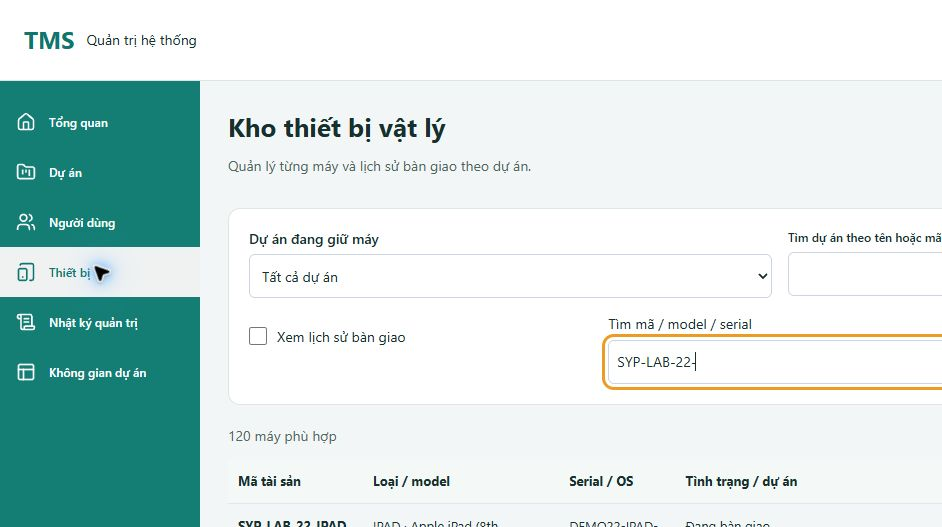

# Kiểm nghiệm và bàn giao dữ liệu V22

Thực hiện 08–09/10/2026 trên `system-design`, sau `6aa40f6`. Phạm vi người dùng: kiểm nghiệm, bổ sung khoảng 100 người theo quyền và nhiều thiết bị để thử hệ thống. Dùng `tdd-workflow`, `security-review`, `verification-loop`; không dùng subagent trong đợt này.

## Kết luận trong phạm vi kiểm tra

Đã nạp V22 lên local `127.0.0.1:3307/tms` sau kiểm thử trên schema riêng và backup. Backend 8080 trả health UP; frontend 5173 hiển thị 120 máy mới. Đã xác minh role, membership, bàn giao, tìm kiếm/phân trang và bảo toàn dữ liệu cũ. Đã phát hiện và sửa lỗi mở biểu mẫu ngoài vùng nhìn thấy ở danh sách dài.

Đạt bàn giao bộ dữ liệu local và các kiểm tra dưới đây. **Chưa ký nghiệm thu toàn sản phẩm/production**: các gate thiết bị thật, UAT người dùng, mất mạng bằng browser, tải đồng thời và phục hồi trên môi trường đích vẫn mở. S11 tiếp tục IN_REVIEW.

## Thay đổi

- V22 chỉ ở `db/demo`, không sửa migration đã chạy. Thêm 100 user (3 PM/20 DEV/77 TESTER), 3 dự án, 120 tài sản (30 iPad/30 iPhone/30 tablet Android/30 smartphone Android), 24 lượt bàn giao cùng cấu hình QA/build/mốc/đợt nháp/audit.
- Không tạo case, Excel, kết quả test, file work hoặc ticket giả. Admin/PM/user cũ giữ quyền và mật khẩu. PM mới không được tạo tài khoản.
- Tài khoản có PBKDF2 salt riêng; mật khẩu công khai chỉ dành cho demo local. Release vẫn không nạp demo. Thiết bị có mã/serial DEMO duy nhất, model/OS/phiên bản, tình trạng và ghi chú cấu hình; không đại diện phần cứng thật.
- Mở Sửa/Bàn giao/Thu hồi trong kho thiết bị đưa focus tới tiêu đề form để trình duyệt cuộn tới; Hủy đưa focus về nút xuất phát. Nếu người dùng chuyển sang bộ lọc thì giữ focus ở bộ lọc. Không khóa Tab như modal vì đây là form inline.

Tài khoản, CSV và cách dùng: [demo-v22.md](../database/demo-v22.md).

## Tái hiện lỗi và hồi quy

Trước sửa, ở 1366×900, bấm Sửa iPad dòng 20: input form ở tọa độ Y≈−2465 trong khi viewport đang ở cuối bảng; focus vẫn ở nút dòng 20. Người dùng không thấy form đã mở.

Test hành vi RED: 2 fail/1 pass (Sửa và Bàn giao không đưa focus tới form). Sau sửa thêm nhánh Thu hồi tải bất đồng bộ; 4/4 pass, toàn Admin 68/68. Browser sau sửa: tiêu đề form được focus và nhìn thấy ở 1366×900, 768×1024, 375×812; hủy quay lại đúng nút dòng 20. Tại 375 px, document rộng 369 px, bảng cuộn ngang trong vùng riêng và dùng ArrowRight khi được focus.

## Kết quả kiểm thử

| Kiểm tra | Kết quả và phạm vi |
| --- | --- |
| Frontend toàn bộ sau sửa | **665/665 PASS**, 57 files; `npm run test:coverage` |
| Coverage frontend đo bằng V8 | Statements **85.13%**, branches **82.30%**, functions **78.75%**, lines **83.42%**; không suy ra chất lượng UI hoặc BE coverage từ tỷ lệ này |
| Frontend build | PASS; bundle JS 560.57 kB / gzip 158.22 kB, vẫn có cảnh báo chunk >500 kB |
| Native F/Q | **9/9 PASS**, `NativeFileWorkQaIntegrationTest`, schema `tms_docstest_202610060003` V19; service/MockMvc + MySQL, không gọi là browser E2E |
| Đồng thời F/Q | **5/5 PASS**, `NativeFileWorkQaConcurrencyTest`, cùng schema V19 |
| Migration V22 | **1/1 PASS**, `NativeScaleDemoMigrationTest`, schema mới `tms_docstest_202610080026`; gồm nhiều kịch bản fresh/upgrade/replay/collision |
| Runner guard | **10/10 PASS**, `node --test scripts/Test-FileWorkQaNative.test.cjs` |
| Backend verify/package | PASS trong native runner; không chạy lại tất cả BE unit/integration suite ngoài phạm vi này |
| Java diagnostics | 204 source files, **0 errors / 0 warnings**; không đo lại coverage backend |
| HTTP preview V22 | **6/6 kịch bản PASS** trên backend18080/schema `tms_docstest_202610080025`; xem bên dưới |
| HTTP bản chính | Đăng nhập Admin/PM/Dev/Tester, đọc counts/project scope; sai quyền Admin→403, dự án ngoài scope→404. Không ghi fixture nghiệp vụ vào `tms` |
| Browser Chrome | Login/Admin users filter PM/Tester, phân trang 77 tester, đổi dự án reset trang; 30 iPad, form ở dòng cuối, cuộn vùng bảng; viewport1366/768/375. Sau áp dụng V22, tìm `SYP-LAB-22-` trên5173 thấy120máy |

F/Q native đã đi qua phân công file → active → Tester bắt đầu/tạm dừng/tiếp tục → OK/P/NG → chặn hoàn tất khi còn pending/NG chưa liên kết → bug → Dev xử lý/báo build → retest FULL_CASE hoặc BUG_ONLY → Tester xác minh → PM đóng; đối chiếu export và byte nguồn. QA gồm trả lời/kiểm lại/thu hồi quyền; inbox có scope theo vai trò. Đây là kiểm nghiệm tự động trên fixture riêng, không phải người dùng tự nghiệm thu qua UI.

Migration V22 kiểm tra:

1. Core release tới V21 không tự cài user demo; local fresh đủ 22 migration.
2. V21→V22 giữ toàn bộ hàng có sẵn và byte workbook fixture; đủ user/hash/role/membership, model/OS/tình trạng/phân bổ/audit.
3. Cả 100 hash xác minh được mật khẩu công khai bằng encoder Spring; 100 hash khác nhau.
4. Khởi động/migrate lại không reset mật khẩu, disabled flag hoặc notes đã sửa.
5. Trùng tài sản xảy ra sau khi INSERT user/project vẫn rollback toàn bộ; Admin bị đổi xuống Tester làm migration dừng, không tự nâng quyền.
6. Fresh không tạo file/case/phiên làm việc/execution/ticket.

RED migration đã chạy trên schema0023 khi chưa có V22. Lượt0024 phát hiện lỗi kiểu Long/Integer trong assertion test (20 so với20), đã sửa test; lượt0026 PASS. Không coi lỗi assertion này là lỗi nghiệp vụ của seed.

HTTP preview dùng session/CSRF thật, kiểm tra:

- Năm trang user đủ100ID duy nhất; role3/20/77.
- Sáu trang thiết bị đủ120ID duy nhất, đủ trường;30 mỗi nhóm;80sẵn sàng/24đang giao/12bảo trì/4ngừng dùng.
- Ba dự án có34/34/32thành viên và12/6/6máy.
- Login7tài khoản đại diện biên nhóm; đúng quyền trung tâm và scope dự án.
- Hai yêu cầu giao cùng máy/version đồng thời: một thành công, một409; thu hồi giữ lịch sử, lặp version cũ409.
- Không cho giao máy bảo trì409.

Các thao tác giao/thu hồi chỉ ghi schema preview. [HTTP preview](evidence/demo-v22/isolated-http.json) và [HTTP bản chính](evidence/demo-v22/main-http.json) chỉ chứa kết quả tổng hợp, không có cookie/token/password hệ thống.

## Áp dụng lên database bàn giao

- Dừng đúng tiến trình TMS8080 trước backup. Backup V21: `var/mysql-native/backups/2026-10-08T17-06-09-480Z-tms.sql` và manifest SHA256 cùng tên; file riêng trên máy, không đưa vào Git.
- So sánh hash từng hàng trên 65 bảng nghiệp vụ trước/sau (loại session/login-rate-limit/Flyway khỏi so sánh biến động). **5.303 hàng cũ giữ nguyên**, không chỉ so số lượng. **8 SHA256 workbook nguồn giữ nguyên**.
- Khởi động `scripts/Start-Backend.ps1`: Flyway tự áp dụng V22, backend8080 health200/UP, nativeMySQL3307. Các bảng mới tăng đúng phạm vi; xem [bảo toàn dữ liệu](evidence/demo-v22/main-preservation.json).
- Đã đăng nhập kiểm tra tài khoản mới và UI trên5173; không dùng dữ liệu demo mới để ghi kết quả test giả vào hệ thống chính. Các phiên kiểm tra được đăng xuất.
- Preview18080/15173 phục vụ kiểm nghiệm riêng; đóng sau khi hoàn tất. Giữ backend8080/frontend5173 cho người dùng.

Bằng chứng bổ sung: [PM desktop](evidence/demo-v22/users-pm-desktop.jpg), [Sửa thiết bị desktop](evidence/demo-v22/device-editor-desktop.jpg), [form mobile](evidence/demo-v22/device-editor-mobile.jpg), [bàn giao tablet](evidence/demo-v22/device-allocation-tablet.jpg).

## Việc còn lại theo góc nhìn khách hàng

1. **UAT bốn vai trò trên UI với workbook của khách hàng:** native/HTTP đạt không thay chữ ký khách hàng hoặc thao tác trọn chuỗi browser.
2. **Thiết bị thật:** chưa kiểm tra Safari iPad/iPhone, Android touch/keyboard hoặc zoom200% trong đợt này; viewport Chrome chỉ kiểm tra bố cục.
3. **Độ bền khi mạng/phiên lỗi:** đã có regression ở tầng code, chưa chạy lại mô phỏng browser mất mạng/hết phiên/hai tab toàn hành trình.
4. **Vận hành:** chưa load test100user đồng thời hoặc restore V22 gồm chứng cứ trên môi trường đích. 100tài khoản seed không phải benchmark100người dùng đồng thời. MySQL9.7 phát cảnh báo nằm ngoài phiên bản đã được Flyway hiện tại kiểm chứng; migration native thực tế PASS, cần kiểm định cặp phiên bản cho production.
5. **Hiệu năng frontend:** bundle vẫn>500kB; chưa có p95 hay số đo thiết bị thật để kết luận nhanh/chậm. Không che cảnh báo bằng tăng ngưỡng.
6. Thông báo đã đọc/chưa đọc lưu bền/xuyên màn vẫn là phần mở của [quality gates](2026-10-08-customer-quality-gates.md), không coi seed hoặc polling hiện có là đã hoàn tất tính năng đó.

Không còn lỗi tái hiện chưa sửa trong phạm vi thay đổi V22/focus được kiểm tra ở đây. Không khẳng định toàn hệ thống không còn lỗi.
